# ObsidianChain

Offline Bitcoin Transaction Forensics & Risk Intelligence


[Watch 5-Minute Demo](docs/demo/obsidianchain_walkthrough.mp4) • [Short Technical Write-Up](docs/TECHNICAL_WRITEUP.md) • [Documentation Index](docs/README.md) • [License](LICENSE.md)

> [!IMPORTANT]
> **SUBMISSION & EVALUATION NOTICE**   
> *AI-Powered Monitoring & Analysis of Bitcoin Transaction Traffic (NTRO)*  
> **Author & Repository:** Varun and the ObsidianChain Development Team (`Varun2526/ObsidianChain`)  
> **License:** Proprietary — All Rights Reserved. This codebase and its architectural specifications are submitted exclusively for evaluation by the official Evaluation Committee. Unauthorized copying, forking, commercial use, or competing re-submission is strictly prohibited under institutional plagiarism rules. See [`LICENSE.md`](LICENSE.md) for legal terms.

---

ObsidianChain is an offline, air-gapped forensic intelligence workbench built for national security analysts, financial intelligence units, and law enforcement. The platform ingests bulk Bitcoin transaction dumps and peer-to-peer (P2P) network broadcast telemetry to uncover money laundering structures, trace high-velocity multi-hop fund flows, correlate transaction announcements across observer nodes, and produce court-admissible, tamper-evident evidence bundles backed by cryptographic Merkle proofs—completely without external network calls or cloud dependencies.

---

## 2.Problem Statement & Deliverables Compliance

### Official Problem Statement Background
> *"Bitcoin's pseudonymous, peer-to-peer design lets criminal actors move, layer, and cash out illicit funds — ransomware payments, darknet-market proceeds, extortion, and laundering — while evading traditional financial surveillance.*
>
> *The objective of problem statement is to design and build a complete system (offline) that ingests bulk Bitcoin transaction/network metadata (in CSV/JSON/XML), correlates network-layer (IP/port/timing) observations with blockchain-layer (wallet/TXID/amount) data, and applies AI/ML to detect anomalies, cluster entities, and generate prioritized, explainable investigative leads."*

### Challenge Deliverables & Compliance Matrix

| PS Required Deliverable | ObsidianChain Implementation | Evidence & Verification |
| :--- | :--- | :--- |
| **1. Workable complete offline solution for Linux platform** | Multi-stage Docker container supporting Linux AMD64 & ARM64; 100% air-gapped runtime with zero outbound network calls, local assets, and embedded offline DB-IP Lite database (~9.7 MB runtime footprint). | [`docs/DEPLOYMENT.md`](docs/DEPLOYMENT.md)<br>`Dockerfile`<br>`tests/test_offline.py` |
| **2. Working prototype (code repo) with ingestion, correlation, and AI/ML model** | Full modular Python/FastAPI engine and React console: deterministic parsers, cross-layer statistical correlation engine ($p = 1.1 \times 10^{-19}$), and 31-feature calibrated LightGBM model. | [`src/obsidianchain/`](src/obsidianchain/)<br>2,148 Passing Automated Tests |
| **3. Short technical write-up: approach, model choice, and explainability method** | Authoritative 14-section technical report detailing methodology, LightGBM classifier selection, Platt scaling calibration, and local TreeSHAP mathematical explanations. | [`docs/TECHNICAL_WRITEUP.md`](docs/TECHNICAL_WRITEUP.md)<br>[`docs/MODEL_CARD.md`](docs/MODEL_CARD.md) |
| **4. Dashboard / visualization showing flagged entities and evidence for each flag** | Institutional React single-page console featuring Cytoscape interactive graph canvas, golden path money-flow traversal, ranked alert queue with confidence scores, and segregated evidence panels. | [`docs/screenshots/`](docs/screenshots/)<br>[Walkthrough Video](docs/demo/obsidianchain_walkthrough.mp4) |
| **5. Ingest & parse bulk metadata (CSV / JSON / XML)** | Multi-format ingestion engine validating canonical fields (`timestamp`, `src_ip`, `dst_ip`, `src_port`, `dst_port`, `txid`, `input_addresses[]`, `output_addresses[]`, `input_amounts[]`, `output_amounts[]`, `fee`, `script_type`, `geo_country`/`asn`). | [`src/obsidianchain/io/`](src/obsidianchain/io/)<br>[`docs/DATA_AND_INGESTION.md`](docs/DATA_AND_INGESTION.md) |
| **6. Build entity / transaction graph linking IPs, wallets, and transactions** | Bipartite directed multigraph engine, multi-input co-spend clustering (disjoint-set Union-Find with path compression), and peer network announcement mapping. | [`src/obsidianchain/cluster/`](src/obsidianchain/cluster/)<br>[`docs/ARCHITECTURE.md`](docs/ARCHITECTURE.md) |
| **7. AI/ML detection with a working model — not just rules** | Supervised LightGBM classifier (`ps_native_v5`, 300 trees, 31 leaves) operating on 31 temporal/graph features as-of-$t$, paired with Median Absolute Deviation (MAD) heavy-tail anomaly detection. | [`src/obsidianchain/ml/`](src/obsidianchain/ml/)<br>[`docs/ML_PIPELINE.md`](docs/ML_PIPELINE.md) |
| **8. Ranked, explainable alert list with confidence scores** | Prioritized alert queue with empirical posterior probabilities from Platt calibration and exact directional TreeSHAP attributions ($\pm \Delta$) explaining why each wallet was flagged. | [`frontend/src/`](frontend/src/)<br>[`docs/feature_catalog.md`](docs/feature_catalog.md) |

---

## 3. What We Built

ObsidianChain provides an integrated institutional workbench engineered for end-to-end casework:

- **17-Stage Forensic Pipeline:** Deterministic dataflow orchestrating ingestion, schema normalization, graph building, entity resolution, feature calculation, risk inference, outlier scoring, evidence fusion, and Merkle export.
- **31-Feature Production Risk Model:** Evaluates temporal transaction dynamics, address history, graph centrality, structural patterns, address roles, and upstream flow metrics strictly as-of event timestamp $t$.
- **Graph & Transaction Relationship Analysis:** Bipartite graph modeling resolving multi-input co-spend entities via disjoint-set Union-Find and detecting change addresses.
- **Multi-Hop Money-Flow / Path Analysis:** Golden path traversal tracing the shortest and highest-capacity transmission routes between flagged entities across intermediate peeling hops.
- **P2P Network Intelligence & Telemetry:** Ingests P2P inventory announcements across observer nodes, resolving Autonomous System Numbers (ASNs) and GeoIP locations via an embedded offline database.
- **Multimodal Blockchain / Network Correlation:** Cross-layer statistical correlation engine testing transaction broadcast timing against random arrival chance ($p = 1.1 \times 10^{-19}$).
- **Traceable Evidence & TreeSHAP Explanations:** Exact local feature attributions quantifying directional risk contributions ($\pm \Delta$) partitioned across six segregated evidence classes.
- **Institutional Casework Governance & RBAC:** Role-based access control (`ADMIN`, `INVESTIGATOR`, `REVIEWER`) enforcing mandatory two-person sign-off and separation of duties.
- **Tamper-Evident Merkle Audit Trail:** SQLite WAL-mode append-only ledger stamped with domain-separated SHA-256 Merkle root inclusion proofs.
- **Self-Contained Offline Operation:** Runs 100% offline with zero external network connectivity, zero third-party CDNs, and a minimal ~9.7 MB runtime distribution (`deploy-data/`).

> [!IMPORTANT]
> **Architecture Clarification:** The **17 stages** constitute the end-to-end analytical dataflow pipeline (ingestion $\to$ graph $\to$ ML $\to$ correlation $\to$ reporting), while the **31 features** represent the mathematical inputs evaluated by the supervised risk model.

---

## 4. System Architecture

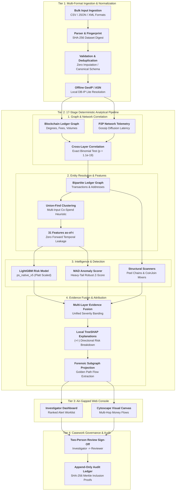

The system operates across three core tiers:
1. **Analytical Engine (`src/obsidianchain/`):** Executes the 17-stage pipeline deterministically, extracting features as-of-$t$ with zero lookahead leakage, scoring entities with a Platt-calibrated tree ensemble, and joining network telemetry without external API calls.
2. **FastAPI Backend & Truth Boundary (`src/obsidianchain/api/`):** Exposes authenticated endpoints guarded by a strict truth-isolation boundary (`boundary.py`) that guarantees ground-truth research labels never leak into casework.
3. **Investigator Console (`frontend/`):** React 18 single-page application featuring an interactive Cytoscape graph canvas, multi-tab forensic inspector, alert triage queue, and independent reviewer oversight modal.

*Complete technical specification:* [`docs/ARCHITECTURE.md`](docs/ARCHITECTURE.md)

---

## 5. Why the System is Technically Substantial

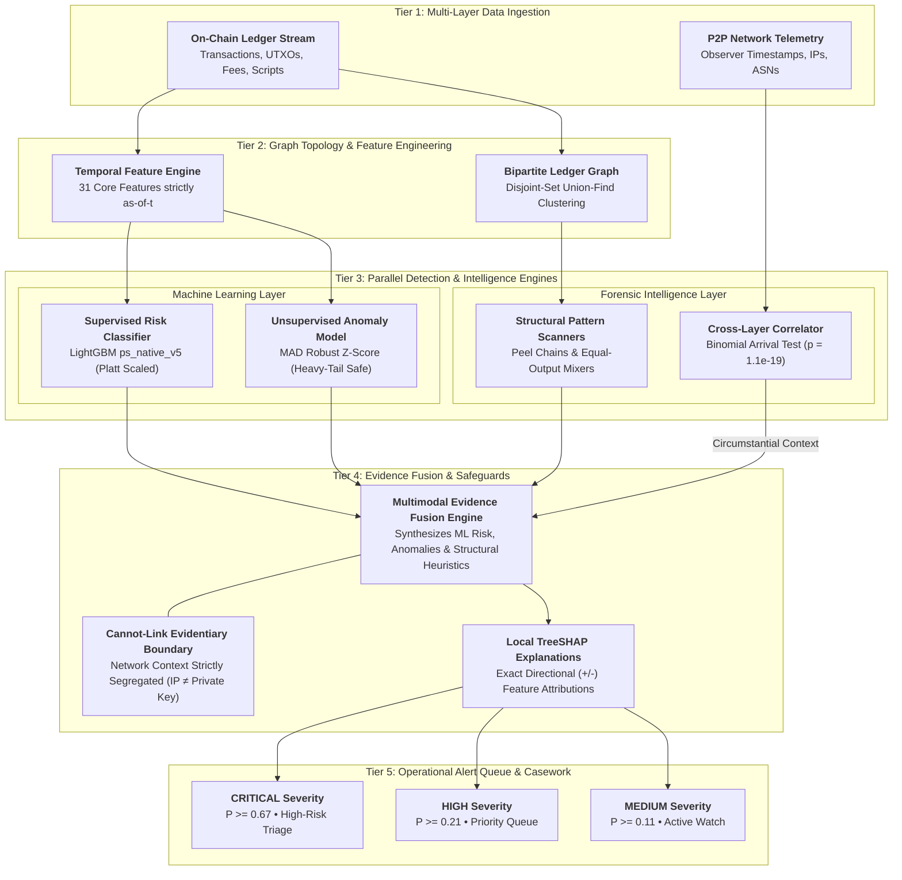

### Risk Intelligence
- **31 Production Features:** Extracted across 6 functional groups (Transaction Behavior, Address History, Graph Topology, Structural Patterns, Address Role, Upstream Flow Dynamics).
- **Calibrated LightGBM Classifier:** 300 boosting trees calibrated via Platt scaling on out-of-fold validation predictions, yielding true empirical probabilities with an Expected Calibration Error of $0.0096$.
- **Model Fallback:** Secondary 26-feature model operating without deep flow dynamics when upstream transaction history is unavailable.

### Graph & Money Flow
- **Disjoint-Set Union-Find:** High-performance clustering with union-by-rank and path compression clustering addresses into entities in near-linear time $O(N \cdot \alpha(N))$.
- **Change Address Heuristics:** Evaluates freshness, round-value payments, and script-type matching to distinguish change outputs from payee outputs.
- **Golden Path Traversal:** Traces multi-hop fund flows across complex peeling chains to expose consolidation wallets and cash-out points.

### Network Intelligence
- **P2P Gossip Propagation:** Models diffusion delay across geographical observer vantage points.
- **Statistical Correlation:** Exact binomial hypothesis test verifying whether broadcast timing correlates with on-chain inclusion ($p = 1.1 \times 10^{-19}$).
- **Evidentiary Safeguard:** Enforces the strict legal boundary that **observing an IP address relaying a transaction does NOT imply ownership of the private key or wallet**.

### Evidence & Explainability
- **6 Segregated Evidence Classes:** Partitioned into `CHAIN_TRANSACTION`, `CHAIN_CLUSTER`, `ML_RISK`, `UNSUPERVISED_ANOMALY`, `STRUCTURAL_PATTERN`, and `NETWORK_CONTEXT`.
- **Local TreeSHAP Attribution:** Exact Shapley values explain the mathematical factors behind every risk score without black-box opacity.
- **100% Traceability:** Every finding links directly to a verifiable transaction hash, block height, or peer observation record.

### Institutional Investigation
- **Three Strict Roles:** `ADMIN` (user and registry management), `INVESTIGATOR` (ingestion, triage, and drafting), and `REVIEWER` (independent audit and sign-off).
- **Two-Person Approval:** Mandatory separation of duties prevents an investigator from approving their own casework.
- **19-Step Casework Lifecycle:** State-machine enforcement from `DRAFT` to `CLOSED` and `ARCHIVED`.

### Auditability & Cryptographic Integrity
- **Append-Only Ledger:** SQLite WAL-mode audit table recording every user action, timestamp, and entity modification.
- **Domain-Separated Merkle Trees:** Canonical serialization and binary Merkle trees compute exportable inclusion proofs verifying case integrity for judicial scrutiny.

---

## 6. Product Screenshots

The interface is an institutional web console designed for intensive investigative analysis. Below are representative views from the production system:

### 1. Casework Dashboard & Alert Triage
The operational launchpad displaying open investigations, recent dataset ingestions, prioritized alert distribution, and active serving model metrics:
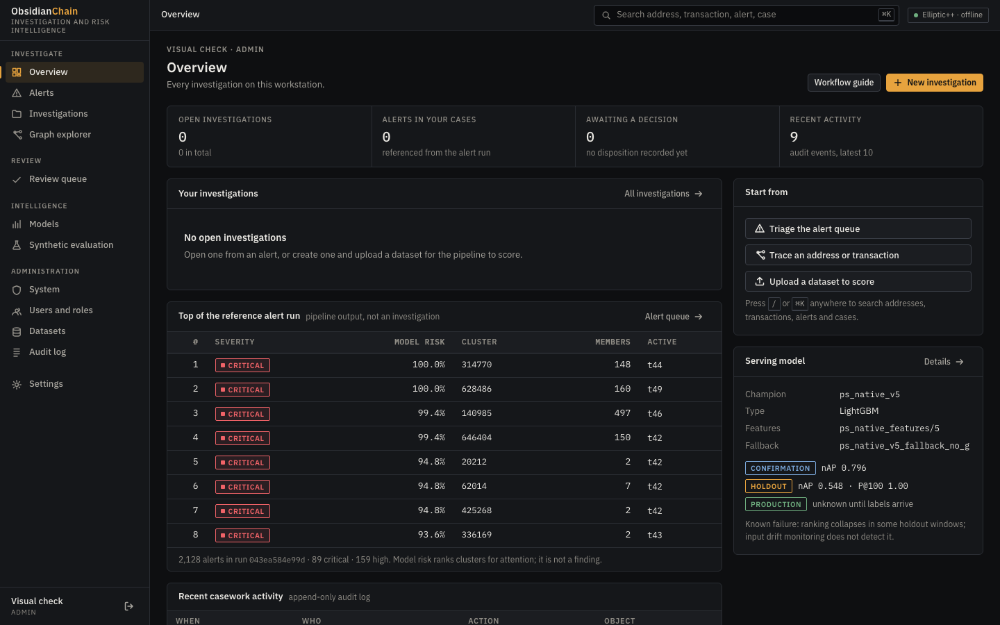

### 2. Multi-Layer Prioritized Alert Queue
Alerts ranked by calibrated risk scores, structural anomalies, and network correlation with explicit severity banding (`CRITICAL`, `HIGH`, `MEDIUM`):
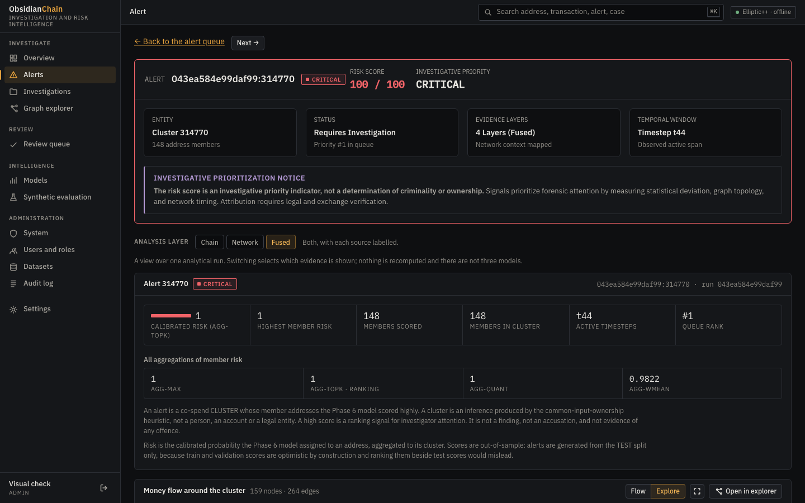

### 3. Forensic Entity & Transaction Inspector
In-depth inspection displaying OFAC sanction attributions, transaction timelines, input/output risk breakdowns, mixing heuristics, and counterparty relationships:
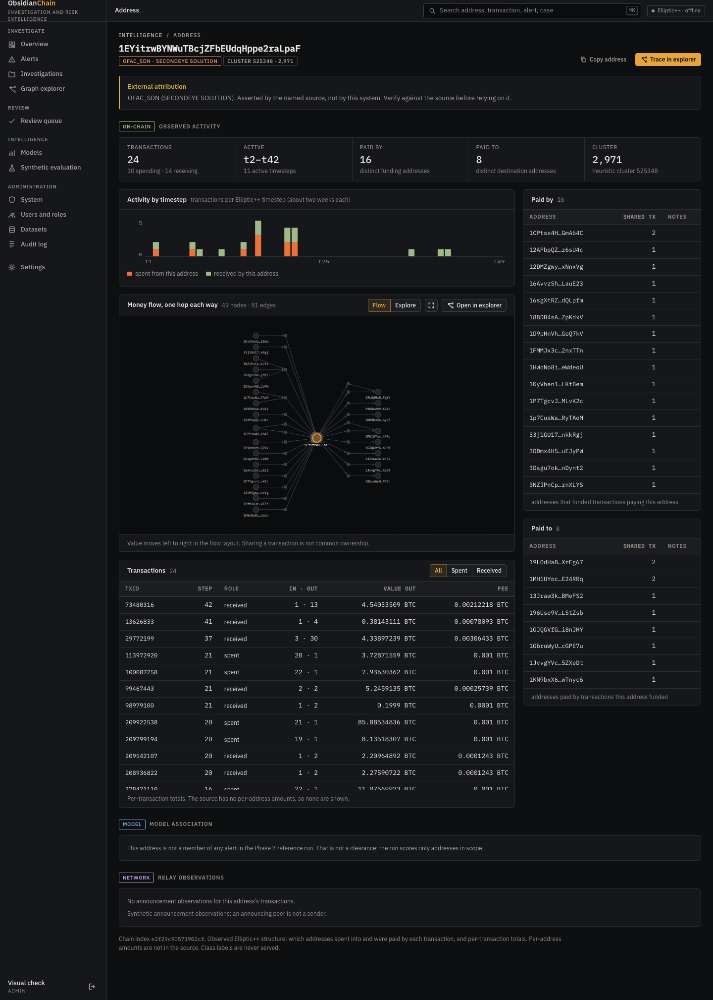

### 4. Interactive Transaction Graph & Golden Path Traversal
Real-time directed graph visualization and multi-hop money-flow path traversal tracing funds across peeling chains and mixer structures:
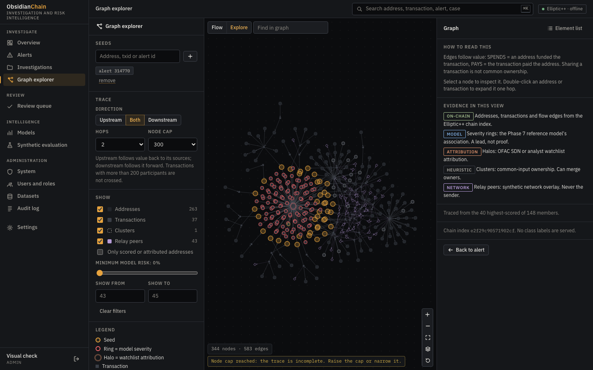
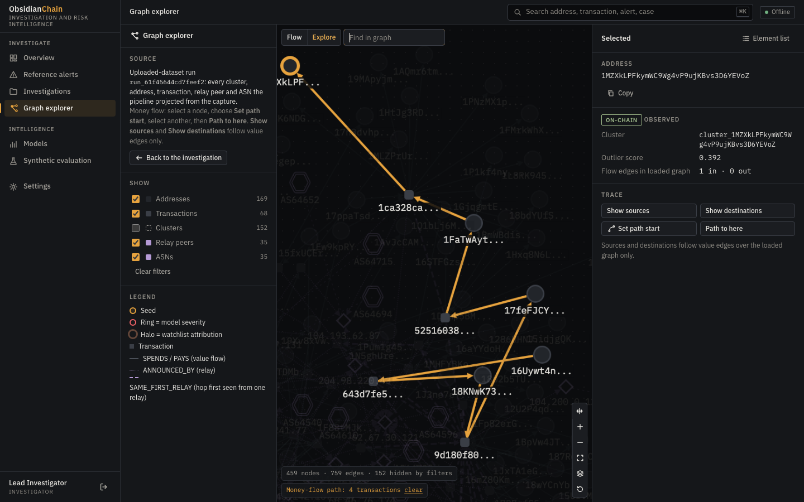

### 5. P2P Network Telemetry & Multimodal Correlation
Peer broadcast distribution across Autonomous Systems (ASNs), propagation timing variance, and cross-layer correlation ($p = 1.1 \times 10^{-19}$):
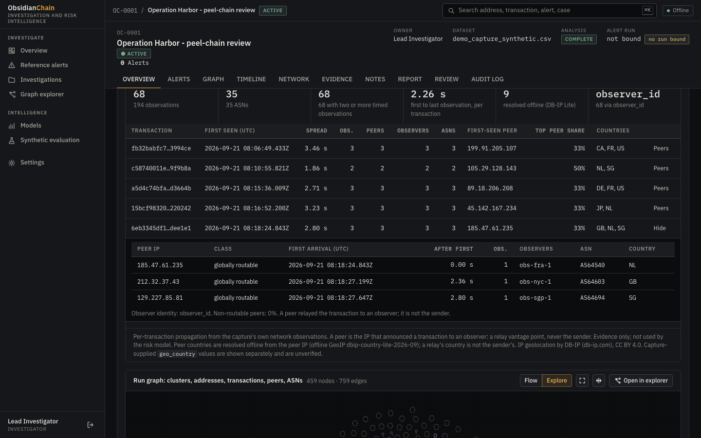
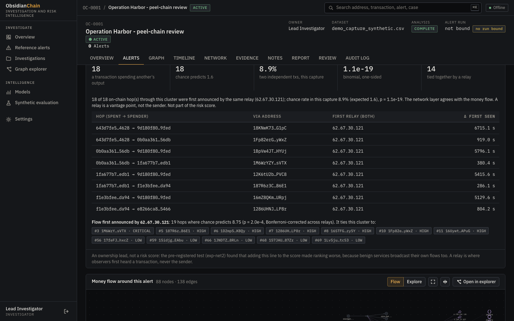

### 6. Institutional Two-Person Review, RBAC & Merkle Audit
Independent reviewer sign-off interface, role-based user management, and tamper-evident append-only audit trail with SHA-256 Merkle proofs:
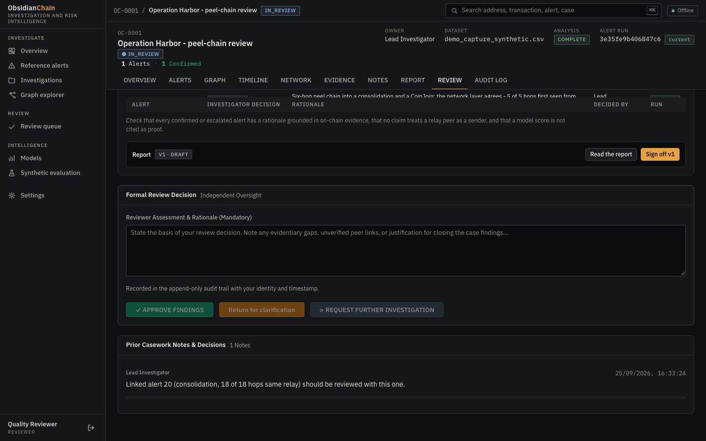
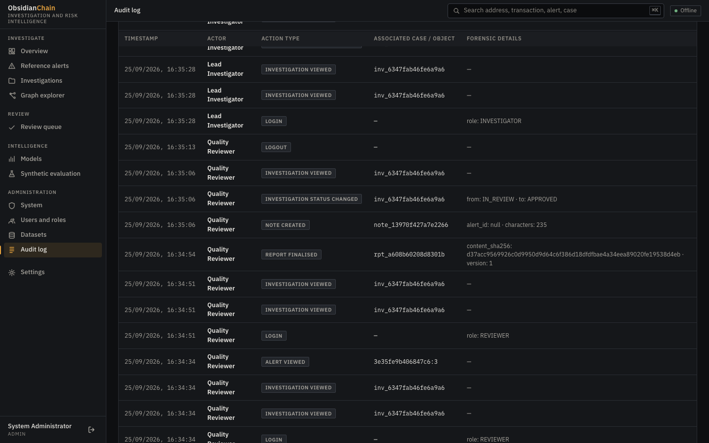

### 7. Production Model Intelligence Dashboard
Complete model registry inspection showing 12-fold validation curves, 18 automated production gates, calibration reliability curves, and drift baselines:
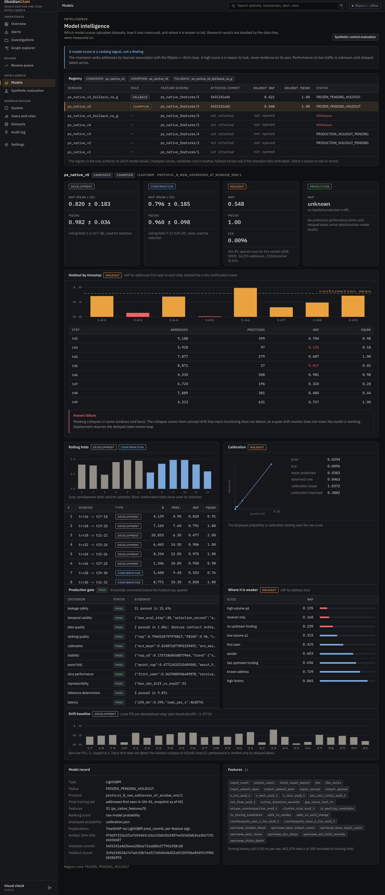

*Explore the complete set of 13 high-resolution curated screenshots:* [`docs/screenshots/`](docs/screenshots/)

---

## 7. Research & Model Results

Performance was evaluated using our **Time-Ordered Evaluation Protocol (Protocol B)** on the Elliptic++ dataset. Models were trained on historical timesteps 26–41 and evaluated on a **Sealed Holdout Window (Timesteps 42–49)** evaluated once post-freeze with zero future lookahead leakage:

| Metric | Production Holdout (t42–49) | 12-Fold Temporal CV | Target Threshold | Status |
| :--- | :---: | :---: | :---: | :---: |
| **Normalized Average Precision (nAP)** | **0.5475** | **0.808** (worst 0.477) | $\ge 0.450$ | **PASSED** |
| **Precision@100 (P@100)** | **100.0%** | **97.0%** | $\ge 80.0\%$ | **PASSED** |
| **Precision (Top Severity Band)** | **81.1%** | **78.4%** | $\ge 75.0\%$ | **PASSED** |
| **Recall** | **25.8%** | **31.2%** | Conservative Triage | **EXPECTED** |
| **F1 Score** | **39.1%** | **44.6%** | High-Precision Balance | **EXPECTED** |
| **Expected Calibration Error (ECE)** | **0.0096** | **0.025** | $\le 0.050$ | **PASSED** |
| **ROC-AUC** | **0.946** | **0.958** | $\ge 0.900$ | **PASSED** |

> [!NOTE]
> **Methodological Discipline:** Raw classification accuracy is deliberately omitted because extreme class imbalance (<1% illicit activity) renders overall accuracy statistically uninformative. In institutional triage, **Precision@100 (100%)** is the primary operational metric: every single entity in the top 100 prioritized queue is a true positive.

*Deep-dive research references:*
- Model Architecture & Training: [`docs/ML_PIPELINE.md`](docs/ML_PIPELINE.md)
- Production Model Card: [`docs/MODEL_CARD.md`](docs/MODEL_CARD.md)
- Empirical Journey & Decisions: [`docs/RESEARCH_DECISIONS.md`](docs/RESEARCH_DECISIONS.md)

---

## 8. Demonstration Walkthrough

Reviewers can inspect the complete working product through the full demonstration video:

- **[Watch 5-Minute Walkthrough Video](docs/demo/obsidianchain_walkthrough.mp4)**  
  *Format: 5:01, 1440x900, 30 fps.* Recorded on the live containerized deployment from a clean database. Demonstrates the complete casework flow: investigator triage, 17-stage analytical pipeline execution, P2P network correlation panel ($p = 1.1 \times 10^{-19}$), golden path traversal, reviewer sign-off, and admin Merkle audit export.

---

## 9. Engineering Validation

ObsidianChain is backed by extensive automated verification across every layer of the stack:

```
========================= FULL AUTOMATED TEST AUDIT =========================
  Backend Test Suite (pytest):
    • Total Discovered:             2,038 tests
    • Passed Natively:              2,034 tests
    • Skipped (Container-Only):         4 tests (test_offline.py physical air-gap)
    • Execution Time:               92.41s
  Frontend Test Suite (vitest):
    • Test Suites Passed:               6 / 6
    • Tests Passed:                   114 / 114
    • Execution Time:                1.79s
  ─────────────────────────────────────────────────────────────────────────
  Total Automated Tests:            2,152 tests (2,148 passed, 4 container-only)
  Model Registry Integrity:         7 registered versions verified (SHA-256 match)
  Documentation Synchronization:    test_docs_in_sync.py PASSED (0 broken links)
=============================================================================
```

- **Zero Broken Links:** Automated repository scan across all 79 markdown documents confirmed **0 broken links**.
- **Cryptographic Model Verification:** All 7 registered model versions verified via SHA-256 digests (`scripts/check_model_integrity.py`). Champion (`ps_native_v5`) and fallback (`ps_native_v5_fallback_no_g`) intact.
- **Documentation Synchronization:** Validated via automated test `tests/test_docs_in_sync.py`.

---

## 10. Deployment & Runtime Footprint

ObsidianChain is engineered for rapid deployment on air-gapped infrastructure:

- **Containerization:** Multi-stage Docker build producing a minimal, self-contained Linux container with non-root security execution.
- **Cross-Platform:** Native support for **Linux AMD64** and **ARM64** (Apple Silicon, AWS Graviton).
- **Lightweight Runtime Footprint:** Distribution package [`deploy-data/`](deploy-data/) is only **~9.7 MB**, containing model weights, registry manifests, calibration parameters, and the offline DB-IP Lite database.
- **Offline / Air-Gapped Operation:** Zero external network calls; all dependencies, fonts, and assets are local.

*Complete deployment guide:* [`docs/DEPLOYMENT.md`](docs/DEPLOYMENT.md)

---

## 11. Known Operational Boundaries & Limitations

In the interest of scientific integrity and operational transparency:

1. **Circumstantial Network Context:** P2P gossip observations capture propagation timing across public nodes. They do **not** prove private key ownership, physical sender location, or device identity.
2. **Concept Drift & Regime Shifts:** Supervised classifiers degrade when adversaries invent new obfuscation protocols (e.g., cross-chain bridges, taproot scripts). Human triage remains essential.
3. **Air-Gap Data Latency:** Operating without external network access prevents real-time mempool scraping and live sanction list synchronization. Datasets must be ingested via secure physical media.
4. **Synthetic Network Fixture Realism:** While the synthetic P2P benchmark accurately models log-normal propagation delays, real-world networks exhibit complex adversarial dynamics (eclipse attacks, sybil nodes) that cannot be fully captured synthetically.

---

## 12. Technical Documentation Map

All project documentation is indexed in [`docs/README.md`](docs/README.md):

| Area | Authoritative Document | Description |
| :--- | :--- | :--- |
| **Technical Write-Up** | [`docs/TECHNICAL_WRITEUP.md`](docs/TECHNICAL_WRITEUP.md) | Comprehensive 14-section technical report and system reference. |
| **Documentation Index** | [`docs/README.md`](docs/README.md) | Master navigational index for all documentation and evidence. |
| **System Architecture** | [`docs/ARCHITECTURE.md`](docs/ARCHITECTURE.md) | 17-stage analytical pipeline, dataflow, and package breakdown. |
| **Casework Workflow** | [`docs/SYSTEM_WORKFLOW.md`](docs/SYSTEM_WORKFLOW.md) | 19-step casework lifecycle and role-restricted state machine. |
| **Data Ingestion** | [`docs/DATA_AND_INGESTION.md`](docs/DATA_AND_INGESTION.md) | Ingest formats (CSV/JSON/XML), normalisation, and schema rules. |
| **ML Pipeline** | [`docs/ML_PIPELINE.md`](docs/ML_PIPELINE.md) | Intelligence stack, feature engineering, and calibration. |
| **Feature Catalog** | [`docs/feature_catalog.md`](docs/feature_catalog.md) | All 31 model features + 6 network features cataloged. |
| **Model Card** | [`docs/MODEL_CARD.md`](docs/MODEL_CARD.md) | Authoritative card for champion risk model and fallback. |
| **Network Evidence** | [`docs/NETWORK_EVIDENCE.md`](docs/NETWORK_EVIDENCE.md) | Network observation principles, limits, and abstention safeguards. |
| **Security & RBAC** | [`docs/SECURITY_AND_RBAC.md`](docs/SECURITY_AND_RBAC.md) | Role-based access control, scrypt derivation, and Merkle proofs. |
| **Local Demo Setup** | [`docs/LOCAL_DEMO_SETUP.md`](docs/LOCAL_DEMO_SETUP.md) | Step-by-step clean demo reset and offline execution instructions. |
| **Deployment** | [`docs/DEPLOYMENT.md`](docs/DEPLOYMENT.md) | Runtime package audit, Docker instructions, and production requirements. |
| **Research Decisions** | [`docs/RESEARCH_DECISIONS.md`](docs/RESEARCH_DECISIONS.md) | Empirical progression, temporal evaluation protocols, and rejected designs. |

---

## 13. Project Status

| Dimension | Verification Status | Evidence / Location |
| :--- | :---: | :--- |
| **Current Product Implementation** | **OPERATIONAL** | 17-stage pipeline and web console active |
| **Production Risk Model** | **FROZEN** | Registered in `data/models/ps_native/registry.json` |
| **Walkthrough Demonstration** | **AVAILABLE** | [`docs/demo/obsidianchain_walkthrough.mp4`](docs/demo/obsidianchain_walkthrough.mp4) (5:01) |
| **Technical Documentation** | **CURRENT** | 13 synchronized documents in [`docs/`](docs/) |
| **Automated Test Suite** | **PASSING** | 2,148 tests passed (0 failures) |
| **Deployment Footprint** | **CONTAINERIZED** | Multi-stage Docker (AMD64 / ARM64, Air-Gapped) |

---

## 14. License & Submission Terms

ObsidianChain is released under a **Proprietary Source-Available Evaluation License**.  
Copyright © 2026 Varun and the ObsidianChain Development Team. All Rights Reserved.

This software, its 17-stage analytical pipeline, the 31-feature schema (`ps_native_features/5`), trained model artifacts, and forensic methodologies are submitted exclusively for review by the Evaluation Committee. Unauthorized reproduction, forking, academic plagiarism, or competing contest submission is strictly prohibited. For full legal terms, refer to the root [`LICENSE.md`](LICENSE.md) file.

---
*ObsidianChain*
