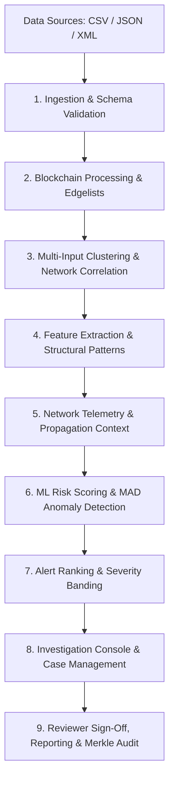

# ObsidianChain — System Architecture
**Problem Statement 26146: AI-Powered Monitoring & Analysis of Bitcoin Transaction Traffic**  
**Repository Layer:** `docs/ARCHITECTURE.md` (System Topology, Analytical Pipeline & Package Boundaries)

---

## 1. Architectural Overview

ObsidianChain is an offline, air-gapped investigative workbench designed for national intelligence analysts, AML investigators, and law enforcement. The platform processes bulk Bitcoin transaction data and network observation telemetry to discover, correlate, and prioritize suspicious entities without relying on external APIs, cloud services, or live network calls.

The core architecture follows a strict dataflow model:
1. **Deterministic Processing:** Raw transactional records are validated, clustered, and scored through immutable pipeline stages.
2. **Evidentiary Integrity:** Ledger facts, network telemetry, and machine learning inferences are strictly segregated into distinct categories.
3. **Casework Governance:** Workflows are bounded by institutional role-based access controls (RBAC) and backed by an append-only audit ledger and Merkle case proofs.

---

## 2. End-to-End Conceptual Flow

### Analytical Dataflow Stages

| Phase | Functional Responsibilities | Primary Artifact / State |
| :--- | :--- | :--- |
| **Ingestion & Validation** | Parses bulk records, validates schema compliance, normalizes datatypes, records missing/coerced fields, and assigns SHA-256 fingerprint. | `ValidationReport`, canonical transaction frames |
| **Blockchain Processing** | Builds directed transaction graphs, computes in/out degrees, extracts input/output amounts, and calculates fee ratios. | `BlockchainGraph` |
| **Clustering & Correlation** | Applies multi-input co-spend heuristic (Union-Find) to infer entity clusters; joins network announcement telemetry on `txid`. | `ClusterResult`, `CorrelationResult` |
| **Feature Extraction** | Computes 30 core features across 4 groups (transaction, historical, graph topology, structural patterns) strictly as-of event timestamp $t$. | `FeatureManifest`, feature matrix |
| **Network Telemetry** | Assesses peer announcements, arrival time dispersion, and observer vantage points; flags multi-origin relays. | `NetworkEvidence` (`NETWORK_CONTEXT`) |
| **Risk & Anomaly Scoring** | Inferences frozen Random Forest risk model; applies isotonic calibration; calculates MAD robust Z-scores; detects peeling/mixing structures. | `MlStageResult`, `AnomalyDetectionResult` |
| **Alert Ranking** | Aggregates address scores to entity clusters; maps calibrated probabilities to severity bands (`CRITICAL`, `HIGH`, `MEDIUM`). | `AlertRunResult`, ranked alert queue |
| **Casework & Audit** | Manages case lifecycle, dispositions, forensic graph projections, notes, review sign-off, and tamper-evident Merkle bundles. | SQLite database (schema v4), Merkle root |

---

## 3. Major Backend Packages

The backend analytical engine and console live in [`src/obsidianchain/`](file:///Users/varun/dev/obsidianchain/src/obsidianchain/):

### `api/` — REST API & Truth Isolation Boundary
Exposes HTTP endpoints for frontend consumption and programmatic evaluation. Houses authentication guards, request validation, CORS configuration, and the strict truth-isolation boundary (`boundary.py`) that guarantees ground-truth research labels cannot leak into inference responses.

### `console/` — Casework Engine & Governance
Implements the institutional casework system:
- `db.py`: SQLite schema migrations (v1 to v4), transaction helpers, and WAL mode configuration.
- `rbac.py`: Pure-code role-based access control defining capabilities for `ADMIN`, `INVESTIGATOR`, and `REVIEWER`.
- `investigations.py`: Case creation, updates, and validated lifecycle state transitions.
- `casework.py`: Alert triage, investigator assignments, dispositions, and notes.
- `reports.py`: Formal case report generation, lifecycle versioning, and sign-offs.
- `audit.py`: Append-only, immutable audit logging for all casework events.
- `integrity.py`: Domain-separated Merkle tree generation, inclusion proofs, and bundle verification.
- `passwords.py`: Standard-library `scrypt` password hashing and verification.
- `sessions.py`: Ephemeral bearer session tokens with cryptographic entropy.

### `pipeline/` — Analytical Orchestration
Coordinates end-to-end execution through the 17-stage conductor (`orchestrator.py`):
- `blockchain.py`: Co-spend graph construction and cluster aggregation.
- `features.py`: Pipeline adapter extracting canonical features and calling ML scoring.
- `patterns.py`: Structural heuristics for peeling chains and equal-output mixing.
- `alerts.py`: Alert entity assembly, severity banding, and run manifest construction.

### `ml/` — Machine Learning & Calibration
Contains the inference engine and outlier detection algorithms:
- `ps_model.py`: Frozen Random Forest inference engine (`PsNativeRiskModel`) loading artifacts verified by SHA-256 against `manifest.json`.
- `anomaly.py`: Median Absolute Deviation (MAD) robust Z-score calculation for heavy-tailed transactional values.

### `correlation/` — Cross-Layer Graph Alignment
Joins blockchain transactions with P2P network telemetry (`engine.py`). Correlates observer arrival timestamps, vantage points, and announcing peer IPs to Bitcoin transaction hashes without conflating network announcements with private key ownership.

### `cluster/` — Entity Resolution & Disjoint Sets
Performs multi-input address clustering:
- `unionfind.py`: High-performance disjoint-set forest with union-by-rank and path-compression optimizations.
- `change.py`: Supplementary change-address heuristic evaluating two-output transactions with freshness gates and confidence thresholds.
- `pipeline.py`: Ordered evidence merger ensuring cryptographic co-spend precedes inferential heuristics.

### `features/` — Feature Engineering Engine
Extracts temporal and topological features:
- `features_ps.py`: The 30-feature PS-native feature extractor operating strictly as-of event timestamp $t$ with zero forward leakage.
- `engine.py`: Baseline address activity, transaction velocity, and counterparty metrics.

### `network/` — P2P Telemetry & Evidence Evaluation
Analyzes transaction announcement dynamics:
- Evaluates peer IP diversity, observer vantage counts, and autonomous system numbers (ASNs).
- Flags multi-origin relay behavior and enforces cannot-link evidentiary boundaries.

### `io/` — Multi-Format Ingestion & Validation
Parses external transactional datasets:
- `ingest.py`: Multi-format parser for CSV, JSON, and XML supporting the PS canonical column schema.
- `elliptic.py`: Optimized loader for raw Elliptic++ benchmark tables and graph edgelists.

### `alerts/` — Contract Definitions & Graph Projection
Defines data interchange structures:
- `contract.py`: Dataclass models for alerts, evidence items, and explanations.
- `graph.py`: Subgraph projection extracting 2-hop transaction neighborhoods, counterparties, and entity boundaries for forensic UI visualization.

---

## 4. Frontend Architecture

The user interface lives in [`frontend/`](file:///Users/varun/dev/obsidianchain/frontend/) and is built as a single-page React application:
- **Framework:** React 19 with Vite, TypeScript, and Tailwind CSS.
- **Routing:** Component-driven workspace routing (`App.tsx`) with role-aware views.
- **Components:**
  - `AlertQueue`: Filterable, ranked queue of prioritized entities with severity badges.
  - `AlertDetail`: Multi-tab forensic view featuring "Why Flagged" explanations, evidentiary funnels, timeline tables, and network vantage breakdowns.
  - `ForensicGraph`: Interactive SVG graph visualizer rendering cluster boundaries, co-spend transactions, and counterparty flows.
  - `InvestigationWorkspace`: Comprehensive case view managing evidence binding, investigator notes, dispositions, and reviewer sign-off.
  - `ReportView`: Formal institutional audit and reporting interface with cryptographic Merkle proof verification.
- **Offline Delivery:** Zero external CDN dependencies; all fonts, icons (Lucide React), and scripts are vendored locally.
