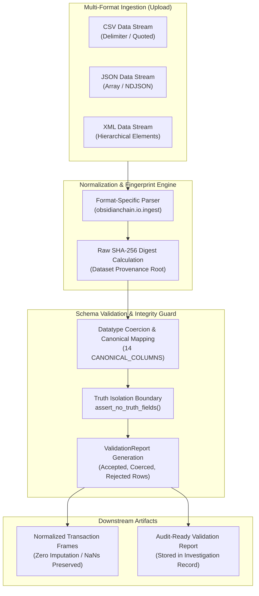

# ObsidianChain — Data Ingestion & Validation
**Problem Statement 26146: AI-Powered Monitoring & Analysis of Bitcoin Transaction Traffic**  
**Repository Layer:** `docs/DATA_AND_INGESTION.md` (Multi-Format Parsers, Schema Validation & Truth Isolation)

---

## 1. Ingestion Overview

ObsidianChain accepts bulk transactional datasets in **CSV, JSON, and XML** formats. Ingestion normalizes diverse input schemas into a unified, canonical tabular format suitable for graph construction and feature extraction.



The ingestion engine follows three strict engineering principles:
1. **Never Silently Impute:** Missing fields are explicitly recorded as absent. Missing values evaluate to `NaN` rather than zero, preserving forensic honesty.
2. **Deterministic Provenance:** Every uploaded dataset is fingerprinted with its raw SHA-256 digest upon upload.
3. **Strict Truth Isolation:** Ground-truth research labels are permanently blocked from reaching production inference, casework records, or UI views.

---

## 2. Canonical Data Contract

Regardless of input format, `obsidianchain.io.ingest` normalizes records into the 14-column canonical schema:

```
CANONICAL_COLUMNS:
[
  "timestamp",        # Unix seconds or ISO8601 timestamp
  "src_ip",           # Announcing peer IP address (IPv4 / IPv6)
  "dst_ip",           # Receiving observer IP (optional)
  "src_port",         # Announcing peer TCP port
  "dst_port",         # Receiving observer TCP port
  "txid",             # 64-character hexadecimal transaction hash (REQUIRED)
  "input_addresses",  # List of input addresses (multi-input co-spend)
  "output_addresses", # List of recipient and change addresses
  "input_amounts",    # List of input satoshi/BTC amounts
  "output_amounts",   # List of output satoshi/BTC amounts
  "fee",              # Transaction fee in satoshis / BTC
  "script_type",      # Witness / script classification (P2PKH, P2SH, P2WPKH, etc.)
  "geo_country",      # Inferred geographic origin from offline GeoIP
  "asn"               # Autonomous system number
]
```

### Required vs. Optional Fields
- **Mandatory Field:** `txid` is strictly required. A transaction without a hash cannot be joined to the blockchain graph or correlated with network events.
- **Blockchain Core:** `timestamp`, `input_addresses`, and `output_addresses` are necessary for temporal feature engineering and Union-Find entity clustering.
- **Network Telemetry:** `src_ip`, `src_port`, `dst_ip`, `dst_port`, and `asn` represent network context. If not present in the capture, they evaluate to `NaN` without causing pipeline rejection.

---

## 3. Multi-Format Input Support

### A. CSV (Comma-Separated Values)
- Handles standard tabular exports from full nodes and block explorers.
- List columns (`input_addresses`, `output_addresses`, `input_amounts`, `output_amounts`) may be supplied as delimiter-separated strings (e.g., semicolon-separated `addr1;addr2`) or JSON array strings.

### B. JSON (JavaScript Object Notation)
- Accepts both JSON arrays of transaction objects (`[ {...}, {...} ]`) and newline-delimited JSON (`NDJSON`).
- Nested address and amount arrays are natively parsed and coerced to canonical list types.

### C. XML (Extensible Markup Language)
- Parses hierarchical XML exports using `xml.etree.ElementTree`.
- Supports `<transactions>` root envelopes with `<transaction>` nodes and child elements for inputs, outputs, amounts, and peer network metadata.

---

## 4. Validation & Error Handling (`validate.py`)

When an investigator uploads a file, the parser generates a comprehensive `ValidationReport`:

```json
{
  "total_records": 10540,
  "accepted_records": 10528,
  "rejected_records": 12,
  "coerced_fields": {
    "timestamp": 420,
    "fee": 18
  },
  "missing_fields": {
    "dst_ip": 10528,
    "dst_port": 10528
  },
  "rejection_reasons": [
    "Row 481: Missing mandatory txid",
    "Row 912: Invalid hex string in txid"
  ]
}
```

### Validation Actions
- **Accepted:** Rows satisfying schema and type constraints.
- **Coerced:** Minor formatting differences automatically normalized (e.g., parsing ISO 8601 strings to integer Unix timestamps, coercing string numbers to floats).
- **Rejected:** Unrecoverable rows (e.g., missing `txid`, unparseable JSON/XML syntax). Rejected rows are isolated with explicit error descriptions and excluded from the analysis.
- **Missing by Design:** Documented fields that this observation model does not require (e.g., passive observers do not record `dst_ip`).

---

## 5. Truth-Label Isolation Rule

> [!CAUTION]
> **RESEARCH GROUND-TRUTH LABELS MUST NEVER ENTER PRODUCTION INGESTION.**

In research datasets such as Elliptic++, records contain ground-truth class labels (`class = 1` for illicit, `class = 2` for licit, `class = 3` for unknown). 

ObsidianChain enforces strict programmatic barriers:
1. **API Boundary Assertion:** `src/obsidianchain/api/boundary.py` executes `assert_no_truth_fields()` on all API serialization layers.
2. **Forbidden Keys:** Any field matching `class`, `label`, `is_illicit`, `ground_truth`, or `target` is rejected immediately.
3. **Casework Integrity:** An analytical system that accepts ground-truth labels during ingestion would produce trivial circular predictions rather than real investigative signals.

---

## 6. Provenance & Artifact Fingerprinting

Every analytical execution is bound to an immutable run fingerprint:
$$\text{Run Fingerprint} = \text{SHA-256}(\text{Dataset SHA-256} \;\|\; \text{Model Version} \;\|\; \text{Pipeline Config})$$

- The run fingerprint is embedded into the parquet metadata of intermediate artifacts and recorded in the SQLite database (`analysis_runs.run_fingerprint`).
- If an investigator attempts to query an alert using an obsolete or mismatched fingerprint, the API returns `409 Conflict`, preventing cross-dataset contamination.

---

## 7. Data Ingestion Limitations

1. **Volume Constraints:** Ingestion is optimized for single batch uploads up to several gigabytes of transaction records in an offline workstation setting.
2. **Missing Input Scripts:** When datasets omit script signatures (e.g., raw CSV without witness data), script-based heuristics degrade gracefully while address and amount features remain functional.
3. **Offline GeoIP:** Local IP-to-country resolution relies on static offline CSV mapping. RFC 1918 private addresses and RFC 5737 documentation addresses correctly return unassigned values rather than false geographical coordinates.
