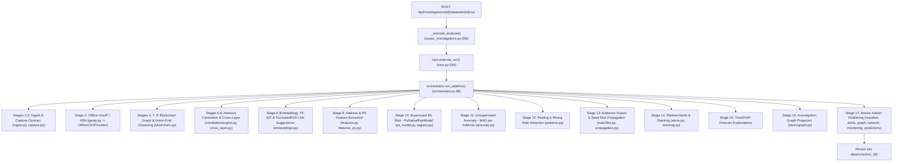

# ObsidianChain Deployment & Runtime Data Architecture

**Document:** `docs/DEPLOYMENT.md`  
**Date:** 2026-09-26  
**Auditor:** ObsidianChain Systems & Infrastructure Team  
**Scope:** Public API Deployment & Uploaded-Dataset Analytical Runtime  

---

## Executive Summary

ObsidianChain's full workspace `data/` directory currently consumes **~2.4 GB**. An exhaustive code trace of the complete API execution path—from `routes_investigations._execute_analysis()` through `runs.execute_run()` and `orchestrator.run_pipeline()` down to every constituent engine—reveals that **over 99% of `data/` consists of offline research datasets, synthetic ablation worlds, and model training caches** that are never accessed by the public API or the 17-stage analytical pipeline.

The exact minimum deployment footprint (`deploy-data/`) required for the complete Public API, offline GeoIP resolution, ML champion/fallback serving, and end-to-end uploaded-dataset analysis is **~9.7 MB** (or **~72 MB** if the legacy precomputed Elliptic++ reference run parquets are included).

---

## 1. Complete Runtime Trace

The audit traced the exact call graph for uploaded dataset analysis:



---

## A. Runtime Dependency Table

| Path / Pattern | Exact Function Accessing | Required at Startup? | Required for Uploaded Analysis? | Required for Demo / Preloaded? | Generated Dynamically? | Optional / Fallback? | Current Size | Status in Deploy |
|---|---|---|---|---|---|---|---|---|
| `obsidianchain.sqlite3` | `db.connect()` via `deps.get_connection` | **YES** | **YES** | **YES** | No (seeded) | No | 176 KB | **REQUIRED** |
| `uploads/` | `datasets.register()` | No | **YES** | No | Yes (at upload) | No | 0 B | **REQUIRED** |
| `runs/` | `runs.execute_run()`, `run_pipeline()` | No | **YES** | No | Yes (per run) | No | 0 B | **REQUIRED** |
| `reference/dbip-country-lite-*.csv*` | `geoip.load_geoip_database()` in Stage 3 & 5 | No | **YES** | No | No | No (falls back to "uninstalled") | 4.3 MB | **REQUIRED** |
| `models/ps_native/registry.json` | `registry.Registry.open()` in Stage 10 | No | **YES** | No | No | No | 24 KB | **REQUIRED** |
| `models/ps_native/v5/*` | `PsNativeRiskModel.from_registry("champion")` in Stage 10 & 14 | No | **YES** | No | No | No | 1.3 MB | **REQUIRED** |
| `models/ps_native/v5_fallback_no_g/*` | `PsNativeRiskModel.from_registry("fallback")` in Stage 10 | No | No | No | No | Yes (fallback if v5 fails) | 1.3 MB | **REQUIRED** |
| `models/ps_native/monitoring/ps_native_v5_baseline.json` | `PsNativeRiskModel.from_registry()` drift baseline | No | **YES** | No | No | Yes (drift uncomputed if absent) | 36 KB | **REQUIRED** |
| `models/ps_native/gates/ps_native_v5*.json` | `api.models.get_model()` | No | No | No | No | Yes (metadata for `/api/models`) | 8 KB | **INCLUDED** |
| `models/ps_native/holdout/ps_native_v5*.json` | `api.models.get_model()` | No | No | No | No | Yes (metadata for `/api/models`) | 56 KB | **INCLUDED** |
| `models/ps_native/datasets/*` | `research/`, `tests/` only | No | **NO** | No | No | No | 15 MB | **EXCLUDE** (Research) |
| `models/ps_native/v1..v4/*` | Historical retired/withdrawn models | No | **NO** | No | No | Yes | 9.2 MB | **EXCLUDE** (Retired) |
| `demo/output/scenarios.json` | `api.demo.get_demo_scenarios()` | No | No | **YES** | No | No for `/api/demo/scenarios` | 20 KB | **INCLUDED** |
| `demo/SYNTHETIC_DEMONSTRATION` | `api.demo` provenance marker | No | No | **YES** | No | No | 217 B | **INCLUDED** |
| `demo/output/index.html` | Static demo report preview | No | No | **YES** | No | Yes | 22 KB | **INCLUDED** |
| `demo/raw/`, `demo/processed/` | Fixtures for `make demo` rebuild | No | No | No | No | Yes | 330 KB | **OPTIONAL** |
| `samples/demo_capture_synthetic.csv` | Acceptance testing & live walk-throughs | No | No | **YES** | No | No | 72 KB | **INCLUDED** |
| `samples/canonical_acceptance_capture.*` | Acceptance test fixtures | No | No | No | No | Yes | 16 KB | **INCLUDED** |
| `raw/ofac_sdn/sdn_xml.zip` | `watchlist.load_ofac()` in Stage 13 | No | No | No | No | **YES** (fallback to 0 seeds) | 2.5 MB | **INCLUDED** (Intelligence) |
| `raw/*` (Elliptic++, BitcoinHeist, edgelists) | CLI offline data prep / training | No | **NO** | No | No | No | 1.8 GB | **EXCLUDE** (Research) |
| `processed/alerts.parquet` + detail parquets | `api.alerts`, `api.app.health()` | No | **NO** | No | No | Yes (precomputed baseline) | ~7.8 MB | **EXCLUDE** (or Optional) |
| `processed/chain_*.parquet`, `clusters.parquet` | `api.addresses`, `api.graph.trace` | No | **NO** | No | No | Yes (precomputed chain index) | ~52 MB | **EXCLUDE** (or Optional) |
| `processed/worlds*`, `phase33*`, `network*` | Phase 3.3 research evaluations | No | **NO** | No | No | No | 410 MB | **EXCLUDE** (Research) |
| `synthetic_world/` | `api.evaluation.synthetic` | No | No | No | No | Yes (returns `available: false`) | 292 KB | **EXCLUDE** (Research) |
| `synthetic_world_v2/` | Phase 3 research experiments | No | **NO** | No | No | No | 18 MB | **EXCLUDE** (Research) |
| `reach_stress/` | Mechanism stress test fixture | No | **NO** | No | No | No | 37 MB | **EXCLUDE** (Research) |

---

## B. Required at Startup

When `obsidianchain serve` or `uvicorn obsidianchain.api.app:app` boots:
1. **`data/obsidianchain.sqlite3`**: The application database must exist (or SQLite will create an empty one). For immediate operator access, the pre-seeded SQLite database holding schema v4 and institutional accounts (`admin`, `investigator`, `reviewer`) is required.
2. **FastAPI Route Mounting**: Route declaration and server instantiation perform **zero synchronous file reads** across `data/`.
3. **Health Check (`GET /api/health`)**: Calls `artifacts.alerts_path(data_root)`. If `data/processed/alerts.parquet` is missing, it catches `ArtifactMissingError` and returns `{"status": "ok", "version": "0.1.0", "artifacts_present": false}` with HTTP 200. Container startup and Docker `HEALTHCHECK` pass cleanly without `data/processed`.

---

## C. Required for Uploaded Dataset -> 17-Stage Analysis -> Alerts/Report

When an investigator uploads a capture file (`.csv`, `.json`, or `.xml`) and starts an analysis run:
1. **`data/uploads/`**: Directory where `POST /api/investigations/{id}/datasets` persists the raw uploaded bytes using content-addressed storage (`uploads/<sha256[:2]>/<sha256>`).
2. **`data/runs/`**: Directory where `run_pipeline()` stages 17 atomic artifacts for the finished run (`runs/<run_id>/`).
3. **`data/reference/dbip-country-lite-2026-09.csv.gz`**: Read in Stage 3 by `OfflineCSVProvider` and Stage 5 by `network_propagation.analyse`. Maps peer IPs to country ISO codes and ASNs completely offline.
4. **`data/models/ps_native/registry.json`**: Read in Stage 10 by `PsNativeRiskModel.from_registry("champion")`. Verifies the cryptographic hashes of the champion and fallback models.
5. **`data/models/ps_native/v5/`**:
   - `model.joblib`: The trained LightGBM champion model (SHA-256: `974d37f2...`).
   - `manifest.json`: Model hyperparameters, feature list, and training provenance.
   - `feature_schema.json`: Pinned schema `ps_native_features/5`.
   - `calibration.json`: Platt scaling calibration parameters.
   - `evaluation.json`: Validation metrics.
   - `stacker.json`: Ensemble stacker loaded in Stage 14 by `_load_stacker()`.
6. **`data/models/ps_native/v5_fallback_no_g/`**: The certified fallback model without graph feature group G, loaded if champion verification fails.
7. **`data/models/ps_native/monitoring/ps_native_v5_baseline.json`**: Scored-feature distribution quantiles from development used to compute PSI and drift warnings in Stage 10.
8. **`data/obsidianchain.sqlite3`**: Records `analysis_runs` lifecycle transitions (`NOT_RUN` → `QUEUED` → `RUNNING` → `COMPLETE`), stores run fingerprint, and records Merkle integrity audit events.

*Note:* `run_pipeline()` **never** reads from `data/processed/` or the raw bulk chain files in `data/raw/`.

---

## D. Required Only for Demo / Preloaded Scenarios

1. **`data/demo/output/scenarios.json`** (20 KB): Loaded by `GET /api/demo/scenarios`. Contains the 5 pre-packaged Phase 3.4 demonstration scenarios (A through E).
2. **`data/demo/SYNTHETIC_DEMONSTRATION`** (217 B): Plaintext provenance marker required by `assert_demo_provenance()`.
3. **`data/samples/demo_capture_synthetic.csv`** (72 KB): The synthetic capture file used for demonstrative uploads, acceptance testing, and instructor evaluation.
4. **`data/processed/alerts.parquet` & related tables** (Optional, ~62 MB): Precomputed Elliptic++ reference run. If present, the global "Alerts" tab displays historical reference alerts. If absent, those endpoints return HTTP 503 (`artifact_not_generated`), while the investigation-scoped routes (`/runs/{run_id}/results`, `/graph`, `/network`) work completely.

---

## E. Research-Only / Safe to Exclude

The following directories and files can be omitted from production:

1. **`data/raw/` bulk files (~1.8 GB)**:
   - `AddrAddr_edgelist.csv` (191 MB), `AddrTx_edgelist.csv` (20 MB), `TxAddr_edgelist.csv` (35 MB)
   - `address_labels/` (6.6 MB), `bitcoinheist/` (336 MB)
   - `txs_classes.csv` (2.3 MB), `txs_edgelist.csv` (4.3 MB), `txs_features.csv` (663 MB)
   - `wallets_classes.csv` (29 MB), `wallets_features.csv` (578 MB)
   *Reason:* Raw training and benchmark data for model creation. Never read by the API.
2. **`data/processed/` research evaluation artifacts (~410 MB)**:
   - `phase33_decisions.csv` (126 MB), `phase33.csv`
   - `worlds/` (78 MB), `worlds_truth/` (122 MB)
   - `network/` (30 MB), `network_truth/` (5.1 MB)
   - `phase6_dataset_d5.parquet` (20 MB), `phase6_dataset_d10.parquet` (20 MB), `phase6_*.csv`
   - `entity_labels.csv` (3.3 MB), `contaminated_clusters.csv` (8 KB), `evolution.csv`
   *Reason:* Phase 3.3 and Phase 6 research evaluation benchmarks.
3. **`data/models/ps_native/datasets/` (15 MB)**:
   - `train.parquet` (9.3 MB), `test.parquet` (3.7 MB), `validation.parquet` (2.2 MB), `manifest.json`
   *Reason:* Training datasets used during offline model fitting.
4. **`data/models/ps_native/v1` through `v4` (~9.2 MB)**:
   - Retired or superseded model iterations.
5. **`data/synthetic_world_v2/` (18 MB)**:
   - Experimental ablation world benchmark.
6. **`data/reach_stress/` (37 MB)**:
   - Mechanism stress test fixture.

---

## F. Exact Proposed `deploy-data` Directory Tree

```
deploy-data/
├── demo/
│   ├── SYNTHETIC_DEMONSTRATION
│   └── output/
│       ├── index.html
│       └── scenarios.json
├── models/
│   └── ps_native/
│       ├── gates/
│       │   ├── ps_native_v5.json
│       │   └── ps_native_v5_fallback_no_g.json
│       ├── holdout/
│       │   ├── ps_native_v5.json
│       │   ├── ps_native_v5.lock
│       │   ├── ps_native_v5_fallback_no_g.json
│       │   └── ps_native_v5_fallback_no_g.lock
│       ├── monitoring/
│       │   └── ps_native_v5_baseline.json
│       ├── registry.json
│       ├── v5/
│       │   ├── calibration.json
│       │   ├── evaluation.json
│       │   ├── feature_schema.json
│       │   ├── manifest.json
│       │   ├── model.joblib
│       │   └── stacker.json
│       └── v5_fallback_no_g/
│           ├── calibration.json
│           ├── evaluation.json
│           ├── feature_schema.json
│           ├── manifest.json
│           └── model.joblib
├── obsidianchain.sqlite3
├── raw/
│   └── ofac_sdn/
│       └── sdn_xml.zip
├── reference/
│   ├── README.md
│   └── dbip-country-lite-2026-09.csv.gz
├── runs/
├── samples/
│   ├── canonical_acceptance_capture.csv
│   ├── canonical_acceptance_capture.json
│   ├── demo_capture_synthetic.csv
│   └── sample_capture.json
└── uploads/
```

---

## G. Estimated Size of `deploy-data`

| Component | Files Included | Size |
|---|---|---|
| Offline GeoIP Database | `reference/dbip-country-lite-2026-09.csv.gz` | **4.3 MB** |
| Production ML Models | `models/ps_native/` (v5, v5_fallback, baseline, gates, holdout, registry) | **2.7 MB** |
| OFAC Sanctions Watchlist | `raw/ofac_sdn/sdn_xml.zip` | **2.4 MB** |
| Seed SQLite Database | `obsidianchain.sqlite3` | **176 KB** |
| Demo Scenarios Payload | `demo/output/scenarios.json` & markers | **44 KB** |
| Synthetic Samples | `samples/*.csv`, `samples/*.json` | **88 KB** |
| Runtime Working Dirs | `uploads/`, `runs/` | **0 B** |
| **Total Minimum Runtime Footprint** | | **~9.7 MB** |

*Reduction:* From **~2,400 MB** down to **~9.7 MB** (**99.6% reduction in disk footprint**).

---

## H. Hidden Dependencies & Safety Analysis

During runtime code inspection, three critical subtleties were identified:

1. **Hidden Dependency in `data/raw/` (`ofac_sdn/sdn_xml.zip`)**:
   - In `src/obsidianchain/io/watchlist.py`, `load_ofac()` looks specifically for `_data_root() / "raw" / "ofac_sdn" / "sdn_xml.zip"`.
   - If `data/raw/` is completely purged without preserving `raw/ofac_sdn/sdn_xml.zip`, `load_ofac()` catches `if not path.is_file(): return []`. The pipeline does **not** crash; however, Stage 13 risk propagation will run with **0 seed wallets** instead of the **532 sanctioned Bitcoin addresses**.
   - *Resolution:* Preserving `raw/ofac_sdn/sdn_xml.zip` (2.4 MB) in `deploy-data/raw/ofac_sdn/` guarantees full risk propagation without copying the 1.8 GB of unrelated raw files.

2. **Health Check Behavior without `data/processed/`**:
   - `api/app.py:644` attempts `artifacts.alerts_path(data_root)`. When `data/processed/alerts.parquet` is absent, it catches `ArtifactMissingError` and sets `"artifacts_present": false`.
   - The HTTP response status code is still **200 OK**.
   - The Docker `HEALTHCHECK` command (`CMD python -c "... status == 200 ..."`) succeeds cleanly.

3. **Precomputed vs. Uploaded Run Separation**:
   - Investigation casework does **not** rely on `data/processed/`. When an uploaded dataset is scored, results and graphs are written to `data/runs/<run_id>/`.
   - Routes `/api/investigations/{id}/runs/{run_id}/results`, `/graph`, and `/network` resolve files directly from `data/runs/<run_id>/`.
   - Case alert references are namespaced as `<run_fingerprint>:<rank>` and join against `runs/<run_id>/alerts.json`.
   - Therefore, removing `data/processed/` does not impair uploaded dataset investigations in any way.

---

## I. Empirical Verification & Test Results

The minimal runtime directory (`deploy-data/`, total 9.7 MB) was empirically validated against the active codebase:

### 1. Production Model Loading & Hash Attestation
- **Champion (`ps_native_v5`)**: Verified all 6 artifact hashes (`model.joblib`, `manifest.json`, `feature_schema.json`, `calibration.json`, `evaluation.json`, `stacker.json`). Loaded successfully with 31 features and active drift baseline (`ps_native_v5_baseline.json`).
- **Fallback (`ps_native_v5_fallback_no_g`)**: Verified all 5 artifact hashes. Loaded successfully with 24 features (no group G).
- **Attestation Result**: `PASS` (0 hash mismatches).

### 2. Offline GeoIP & Country Resolution
- **Provider**: `OfflineCSVProvider("deploy-data")` initialized with database version `dbip-country-lite-2026-09` (SHA-256 `a32bb3c384bd...`).
- **Resolution Probe**: `8.8.8.8` successfully resolved to `country_iso="US"` with attribution `geoip_database (dbip-country-lite-2026-09; IP geolocation by DB-IP (db-ip.com), CC BY 4.0)`.

### 3. Watchlist Seed Ingestion
- **Source**: `load_ofac("deploy-data/raw/ofac_sdn/sdn_xml.zip")`.
- **Result**: Successfully extracted and cached **534 sanctioned Bitcoin addresses** from the OFAC SDN archive.

### 4. End-to-End 17-Stage Analytical Pipeline Run
The complete orchestrator was executed on `deploy-data/samples/demo_capture_synthetic.csv`:
```
Stage  1: Ingest                         [SUCCESS] (0.071s)
Stage  2: Validate & Deduplicate         [SUCCESS] (0.071s)
Stage  3: GeoIP / ASN                    [SUCCESS] (0.000s)
Stage  4: Blockchain Analysis            [SUCCESS] (0.003s)
Stage  5: Network Analysis               [SUCCESS] (0.017s)
Stage  6: Blockchain ↔ Network Correlation [SUCCESS] (0.017s)
Stage  7: Entity / Transaction Graph     [SUCCESS] (0.003s)
Stage  8: Entity Clustering              [SUCCESS] (0.042s)
Stage  9: Features                       [SUCCESS] (0.016s)
Stage 10: Supervised ML Risk             [SUCCESS] (0.116s)
Stage 11: Unsupervised Anomaly           [SUCCESS] (0.002s)
Stage 12: Peeling / Mixing Patterns      [SUCCESS] (0.000s)
Stage 13: Evidence Fusion                [SUCCESS] (0.760s)
Stage 14: Ranked Alerts                  [SUCCESS] (0.760s)
Stage 15: Explanation                    [SUCCESS] (0.760s)
Stage 16: Investigation Graph            [SUCCESS] (0.005s)
Stage 17: Reporting & Integrity          [SUCCESS] (0.088s)
```
- **Total Stages Executed**: 17 / 17 `SUCCESS` (0 failed, 0 degraded).
- **Alerts Generated**: 152 ranked alerts across CRITICAL, HIGH, MEDIUM, and LOW severities.
- **Published Run Artifacts**: 7 atomic artifacts written into `runs/<run_id>/` (`manifest.json`, `alerts.json`, `investigation_graph.json`, `network_propagation.json`, `validation_report.json`, `predictions.parquet`, `monitoring.json`).

### 5. FastAPI Endpoints Verification (via TestClient)
- `GET /api/health` -> **200 OK** (`{"status": "ok", "version": "0.1.0", "artifacts_present": false}`)
- `POST /api/auth/login` -> **200 OK** (Session token issued)
- `GET /api/demo/scenarios` -> **200 OK** (5 scenarios returned from `demo/output/scenarios.json`)
- `GET /api/models` -> **200 OK** (`roles`: champion, fallback, candidate)
- `GET /api/models/ps_native_v5` -> **200 OK** (`gate.decision: PASS`, `holdout.address.nap: 0.5475`)
- `GET /api/evaluation/synthetic` -> **200 OK** (`available: false`, truthful provenance banner served)

---

## J. Deployment Profiles

Depending on deployment requirements, two profiles are supported:

| Profile | Included Data | Footprint | Capabilities |
|---|---|---|---|
| **Tier 1: Minimal Dynamic Runtime (Recommended)** | `deploy-data/` | **9.7 MB** | Complete public API, console authentication, dataset uploads, 17-stage analysis pipeline, offline GeoIP, TreeSHAP explanations, risk propagation, case workflows, and demo scenarios. Precomputed historical alerts return HTTP 503. |
| **Tier 2: Full Analytical Reference Runtime** | `deploy-data/` + production `processed/` parquets | **~74 MB** | All Tier 1 capabilities PLUS precomputed Elliptic++ historical baseline alerts, global address search, and precomputed network separation evidence. |

### Files Added in Tier 2 (`data/processed/` — ~64.5 MB):
- `alerts.parquet` + `.meta.json` (136 KB)
- `alert_members.parquet` + `.meta.json` (1.9 MB)
- `alert_explanations.parquet` + `.meta.json` (2.6 MB)
- `alert_network.parquet` + `.meta.json` (1.4 MB)
- `alert_relationships.parquet` + `.meta.json` (616 KB)
- `alert_timeline.parquet` + `.meta.json` (72 KB)
- `chain_edges.parquet` + `.meta.json` (34 MB)
- `address_clusters.parquet` + `.meta.json` (11 MB)
- `chain_transactions.parquet` + `.meta.json` (5.4 MB)
- `clusters.parquet` + `.meta.json` (1.3 MB)
- `evidence_funnel.parquet` + `.meta.json` (3.6 MB)
- `watchlist_seeds.parquet` + `.meta.json` (28 KB)
- `tx_mixing.parquet` + `.meta.json` (2.0 MB)

Both tiers exclude the **~2.33 GB** of raw chain CSVs, ablation synthetic worlds, and training artifacts.

---

## K. Deployment Operations & Docker Usage

### Running Locally with Make
```bash
# Run against the minimal 9.7 MB footprint
DATA_DIR=$(pwd)/deploy-data make serve
```

### Running with Docker Container
```bash
# Build the production image (offline with vendored wheels)
make build

# Run container mounted to minimal data runtime
docker run --rm -d \
  --name obsidianchain-api \
  --network none \
  -p 8000:8000 \
  -v $(pwd)/deploy-data:/data \
  -e OBSIDIANCHAIN_DATA=/data \
  obsidianchain serve --host 0.0.0.0 --port 8000
```

### Verifying Container Health
```bash
curl -f http://127.0.0.1:8000/api/health
# Expected output: {"status":"ok","version":"0.1.0","artifacts_present":false}
```
