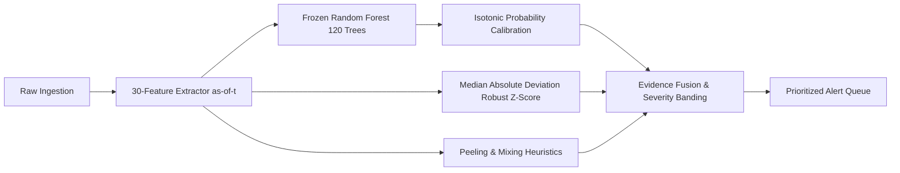

# ObsidianChain — Machine Learning & Intelligence Pipeline

> **Superseded (2026-09-25).** The production model is **ObsidianChain Risk Model (internal identifier: `ps_native_v5`, LightGBM)** (31 features, schema `ps_native_features/5`, 300 trees), served from `data/models/ps_native/registry.json` (champion) with **Risk Model Fallback** (`ps_native_v5_fallback_no_g`) as fallback. The Random Forest described below is the Legacy Random Forest Baseline (`ps_native_v1`): registered, holding no role, and not used by any production path (`docs/archive/audit/2026-09-25-system-truth-audit.md` section 7). Current record: the Models page, or `obsidianchain model list`.

> **Audit note (2026-09-22).** The figures below are single-window point
> estimates and are superseded as a basis for model selection. Measured
> fold-to-fold standard deviation on this problem is ~0.18 nAP — roughly 35x
> the seed-to-seed spread — so a single validation number cannot rank two
> models. The canonical protocol is `src/obsidianchain/ml/protocol.py`
> (12 rolling-origin folds, paired t-test, Holm correction, sealed holdout);
> see `docs/archive/decisions/0001-two-production-model-paths.md` for scope.
> The advertised severity-band precision (90/75/50%) is **not delivered**:
> measured 82.2% on validation and 37.2% on test for CRITICAL, because a
> rank-derived cutoff is applied as a value threshold under heavy score ties.

**Problem Statement 26146: AI-Powered Monitoring & Analysis of Bitcoin Transaction Traffic**  
**Repository Layer:** `docs/ML_PIPELINE.md` (Supervised Risk Modeling, Probability Calibration & Anomaly Detection)

---

## 1. Intelligence Stack Architecture

ObsidianChain employs a layered intelligence stack to prioritize investigative attention. Machine learning models in this system **do not establish legal guilt, prove criminal identity, or automate enforcement**. They generate calibrated risk signals and outlier indicators to assist human investigators in triaging high-volume Bitcoin transaction flows.

---

## 2. Production Intelligence Stack

### 2.1. Supervised Risk Model (legacy v1, superseded; see the note at the top)
- **Algorithm:** Random Forest Classifier (`sklearn.ensemble.RandomForestClassifier`)
- **Hyperparameters:**
  - `n_estimators = 100`
  - `max_depth = 12`  <!-- and min_samples_leaf = 20 -->
  - `class_weight = "balanced_subsample"`
  - `random_state = 42`
  - `n_jobs = -1`
- **Artifact Version:** `ps_native_v1`
- **Model Path:** `data/models/ps_native/v1/model.joblib`
- **Artifact Hash (SHA-256):** `7d9c1b404872fd1b05ecb4ff99648904c89f6f5ee1502e6c2915bc6f4d7ad65d`

### 2.2. Probability Calibration
Raw tree ensemble voting proportions frequently deviate from true empirical probabilities under extreme class imbalance.
- **Method:** Isotonic Regression (`sklearn.isotonic.IsotonicRegression`)
- **Fitting Discipline:** Fit **strictly on the Validation split (timesteps 35–41)**; never fit on training data.
- **Calibration Performance:** Reduced Brier score loss from **0.04186** (raw) to **0.03612** (calibrated).
- **Monotonicity:** Ensures that higher scores strictly correspond to higher empirical risk.

### 2.3. Severity Bands & Operational Thresholds
Thresholds were derived on validation data to meet specific forensic precision targets:

| Severity Band | Minimum Calibrated Probability | Target Precision | Validation Precision | Validation Support | Operational Intent |
| :--- | :--- | :--- | :--- | :--- | :--- |
| **`CRITICAL`** | **$\ge 0.6697$** | 90.0% | **90.0%** | 840 | Immediate triage; high probability of illicit association. |
| **`HIGH`** | **$\ge 0.2149$** | 75.0% | **75.0%** | 1,452 | Standard priority review queue. |
| **`MEDIUM`** | **$\ge 0.1139$** | 50.0% | **50.0%** | 2,602 | Investigative monitoring; secondary triage. |
| **`LOW`** | $< 0.1139$ | — | — | Remainder | Low investigative priority; recorded in ledger. |

### 2.4. Unsupervised Anomaly Detection (MAD)
To detect novel laundering techniques or unmodeled transaction behavior without relying on historical labels:
- **Method:** Median Absolute Deviation (MAD) robust Z-scoring per address (`src/obsidianchain/ml/anomaly.py`).
- **Formula:**
  $$\text{MAD} = \text{median}(|x_i - \tilde{x}|), \quad Z_{\text{MAD}} = \frac{0.6745 \cdot (x_i - \tilde{x})}{\text{MAD}}$$
- **Rationale:** Standard Gaussian Z-scores are severely distorted by heavy-tailed Bitcoin transaction values. MAD provides breakdown resistance up to 50% outliers, preventing massive exchange transactions from skewing baseline metrics.

### 2.5. Structural Pattern Detection
Rule-based structural heuristics evaluate topological patterns:
- **Peeling Chain Detection:** Identifies chains of 2-output transactions where one output repeatedly spends small amounts while the majority value peels into fresh addresses across consecutive blocks.
- **Mixing Heuristics:** Flags transactions with equal-valued outputs and high output entropy matching CoinJoin or Wasabi-style mixing patterns.

---

## 3. Feature Engineering Schema (30 Core + 4 Network)

Features are extracted strictly as of event timestamp $t$ (`src/obsidianchain/features/features_ps.py`):

| Group | Features | Description |
| :--- | :--- | :--- |
| **Group A: Transaction Behaviour** (12) | `input_count`, `output_count`, `total_input_amount`, `total_output_amount`, `fee`, `fee_ratio`, `input_amount_mean`, `input_amount_max`, `input_amount_std`, `output_amount_mean`, `output_amount_max`, `output_amount_std` | Instantaneous transaction attributes at event time $t$. |
| **Group B: Historical Behaviour** (10) | `n_txs_asof_t`, `n_sent_asof_t`, `n_recv_asof_t`, `btc_sent_total_asof_t`, `btc_recv_total_asof_t`, `net_flow_asof_t`, `mean_fee_ratio_asof_t`, `active_duration_seconds`, `tx_velocity_per_hour`, `gap_since_last_tx` | Historical profile of the address accumulated strictly up to time $t$. |
| **Group C: Graph & Topology** (4) | `in_degree_asof_t`, `out_degree_asof_t`, `unique_counterparties_asof_t`, `cluster_size_asof_t` | Local 1-hop and 2-hop topological connectivity and co-spend cluster size as of $t$. |
| **Group D: Structural Patterns** (4) | `is_peeling_candidate`, `is_mixing_candidate`, `equal_output_count`, `output_entropy` | Algorithmic indicators for laundering morphology. |
| **Group E: Network Telemetry (Optional)** (4) | `network_observation_count`, `observer_diversity`, `peer_count`, `asn_count` | Peer announcement dispersion and observer vantage counts. **Evaluates to `NaN` when unobserved; never imputed as zero.** |

### Leakage Controls & Temporal Split Discipline
To prevent data leakage, 6 invariants are verified by automated tests (`tests/test_ps_features_leakage.py`):
1. Future transactions cannot modify feature states at earlier timestamps.
2. Future counterparties cannot alter historical degree counts.
3. Future cluster expansions cannot alter historical cluster sizes.
4. Future transactions cannot retroactively trigger peeling or mixing flags.
5. Ground-truth labels cannot enter the feature matrix.
6. Split boundaries are partitioned chronologically by earliest address appearance.

---

## 4. Model Selection & Research Progression

During research evaluation, candidate model architectures were benchmarked on the Elliptic++ dataset using a strict temporal split:
- **Train Split (Timesteps 1–34):** 170,404 labeled address events (5.47% illicit prevalence).
- **Validation Split (Timesteps 35–41):** 37,694 labeled address events (6.26% illicit prevalence).
- **Test Split (Timesteps 42–49):** 54,335 labeled address events (4.63% illicit prevalence) held out until final freeze.
- **Handling Unknowns:** Class 3 ("unknown") transactions are strictly excluded from supervised training loss and evaluation metrics.

### Model Comparison on Validation Set (Timesteps 35–41)

| Candidate Model | Validation PR-AUC | Validation ROC-AUC | Precision@100 | Precision@500 | Validation Brier Score | Fit Time | Outcome |
| :--- | :--- | :--- | :--- | :--- | :--- | :--- | :--- |
| **Logistic Regression** (L2 penalty) | 0.2654 | 0.7903 | 55.0% | 54.0% | 0.2014 | 0.46s | Rejected: failed to model non-linear topology interactions. |
| **LightGBM** (100 trees, lr=0.05) | 0.5228 | **0.8693** | 71.0% | 93.4% | 0.0445 | 1.49s | Rejected for production: lower top-100 precision than RF. |
| **Random Forest** (100 trees, depth=12, min_samples_leaf=20) | **0.5702** | 0.8606 | **99.0%** | **94.4%** | **0.0419** | 1.25s | **SELECTED & FROZEN** (Winner on primary metric and top-tier precision). |

*Note: No-skill random guess PR-AUC baseline on Validation = 0.0626. All models significantly outperform random baseline.*

### Why Random Forest Was Selected for Production
1. **Superior Precision at Top Ranks:** Random Forest achieved **99.0% Precision@100** on validation data (compared to 71.0% for LightGBM), ensuring that the highest-priority alerts presented to investigators are true positives.
2. **Highest Overall PR-AUC:** Achieved **0.5702 PR-AUC** on validation data, exceeding LightGBM (+0.0474) and vastly outperforming Logistic Regression (+0.3048).
3. **Resilience to Distribution Shift:** Bagged tree ensembles exhibited greater stability across temporal boundaries without aggressive over-fitting on minority-class leaf nodes.
4. **Historical Role of LightGBM:** LightGBM remains an important research baseline in `research/` benchmarks, but is **not** the production inference model.

### Final Held-Out Test Set Performance (Timesteps 42–49)
Evaluated once at production freeze to confirm out-of-distribution temporal generalization:
- **Test PR-AUC:** **0.2079** (vs random prevalence baseline of **0.0463**, a **+0.1616 lift**)
- **Test ROC-AUC:** **0.7367**
- **Test Precision@100:** **97.0%** (97 of the top 100 alerts on unseen forward timesteps were true positives)
- **Test Precision@500:** **81.2%**

---

## 5. System Limitations & Boundaries

1. **No Proof of Criminality:** Risk scores represent statistical correlations with historical illicit patterns. They do not constitute legal proof of illegal activity.
2. **Temporal Degradation:** Model performance naturally experiences decay over extended forward horizons due to evolving adversary tactics. Periodic retraining on new chronological epochs is required.
3. **Missing Network Data:** In pure blockchain captures where network telemetry is absent, Group E features evaluate to `NaN` and the model relies exclusively on on-chain features without performance failure.
