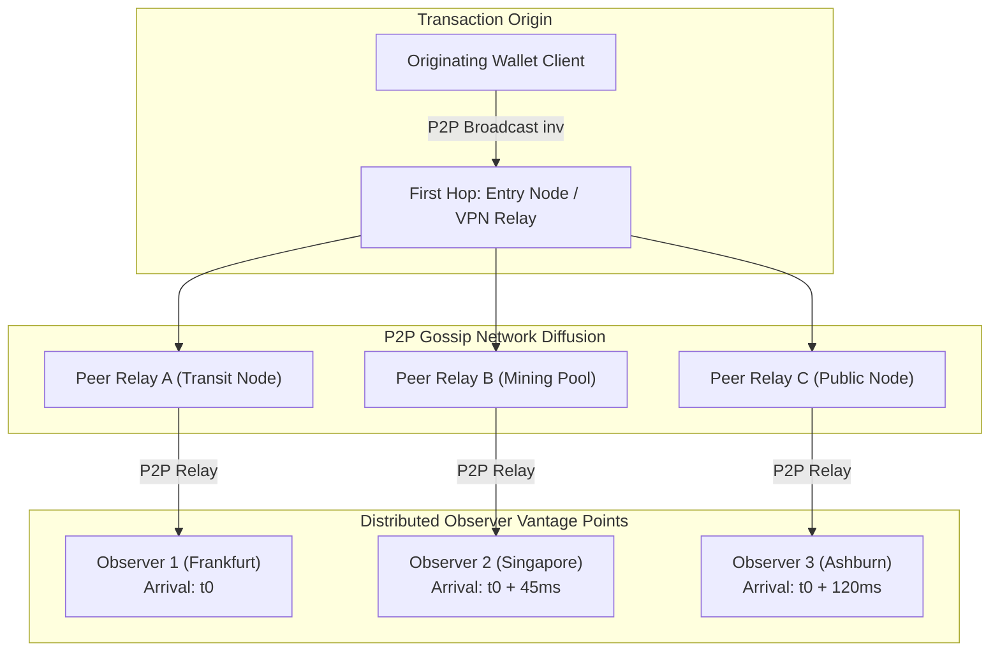
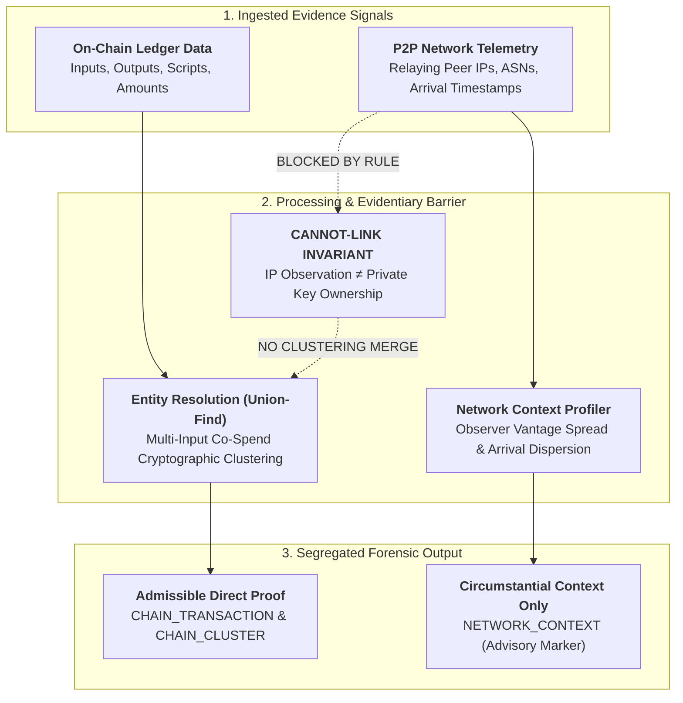

# ObsidianChain — Network Telemetry & Evidentiary Boundaries
**AI-Powered Monitoring & Analysis of Bitcoin Transaction Traffic**  
**Repository Layer:** `docs/NETWORK_EVIDENCE.md` (P2P Telemetry, Propagation Realities & Evidentiary Safeguards)

---

## 1. Why Network Evidence Exists

Bitcoin is a peer-to-peer gossip network. When a wallet signs and broadcasts a transaction, the transaction does not travel directly to a central ledger; it propagates across an unstructured network graph via `inv`/`getdata`/`tx` message exchanges between interconnected nodes.

ObsidianChain incorporates network observation telemetry (`timestamp_ms`, `src_ip`, `dst_ip`, `src_port`, `dst_port`, `peer_asn`, `observer_id`) alongside on-chain blockchain records to provide **investigative context** regarding transaction propagation, observer arrival timing, and candidate separation.

---

## 2. Realities of P2P Network Propagation

Empirical research on Bitcoin's P2P gossip protocol and controlled network evaluations reveal fundamental dynamics:

1. **Multi-Peer Announcement Relay:**  
   In empirical captures, over **84% of transactions are announced to observers by multiple distinct peers within hundreds of milliseconds**. An observer records the IP of the *relaying peer*, not the originating wallet.
2. **Diffusion Dynamics:**  
   Transactions propagate through randomized trickle timers and gossip diffusion. The first node to announce a transaction to a specific observer is rarely the transaction's creator; it is frequently a well-connected transit node, public relay, or mining pool node.
3. **Observer Vantage Variation:**  
   Different listening nodes (observers) receive the same transaction at different times and from different peers depending on their geographic position and peer topologies.

---

## 3. Critical Network Telemetry Limitations

Network evidence must be interpreted with extreme technical discipline. The following real-world networking phenomena invalidate simplistic assumptions:

### A. Shared Infrastructure & Public Gateways
Thousands of independent, unrelated Bitcoin users broadcast transactions through shared intermediaries:
- **Public Electrum Servers:** Broadcast thousands of transactions daily on behalf of lightweight mobile and desktop wallets.
- **Web Wallets & Custodial Services:** Submit transactions from centralized server clusters sharing single egress IP ranges.
- **Mining Pool Gateways:** Broadcast block and transaction announcements across fixed backbone infrastructure.

### B. Network Address Translation (NAT & CGNAT)
In modern residential and mobile carrier networks (Carrier-Grade NAT), hundreds or thousands of distinct subscribers share a single public IPv4 address simultaneously.

### C. Dynamic Addressing (DHCP)
Residential ISPs dynamically reassign IP addresses every few hours or days. An IP associated with a transaction today may be assigned to an entirely unrelated subscriber tomorrow.

### D. Privacy Overlays (Tor, I2P, VPNs)
Many cryptocurrency users deliberately route traffic through privacy networks:
- **Tor Exit Nodes:** An IP address belonging to a Tor exit relay reflects the exit relay operator, never the wallet owner.
- **Commercial VPN Endpoints:** Hundreds of simultaneous users funnel traffic through identical VPN egress points.

---

## 4. Production Evidentiary Safeguards & Policy

To prevent miscarriages of justice and erroneous forensic conclusions, ObsidianChain enforces strict operational safeguards in code:

### The Cardinal Rule
> [!CAUTION]
> **NETWORK TELEMETRY CANNOT AND DOES NOT ESTABLISH WALLET OWNERSHIP OR PERSONAL IDENTITY.**
>
> In ObsidianChain:
> - `IP ≠ Wallet Owner`
> - `Same IP ≠ Same Legal Entity`
> - `Peer IP ≠ Originating Client`

### How Telemetry May Be Used (Admissible Context)
1. **Investigative Context (`NETWORK_CONTEXT`):**  
   Observing that a transaction was received simultaneously across multiple international vantage points provides context on propagation velocity and network presence.
2. **Propagation Timing & Dispersion:**  
   Arrival time variance across observers helps distinguish rapid global diffusion from localized broadcast anomalies.
3. **Negative Evidence / Cannot-Link Hypothesis:**  
   Network characteristics may provide candidate hypotheses for *separating* unrelated activities (e.g., transactions originating with fundamentally incompatible ASN routing and temporal profiles over extended periods), but cannot definitively merge them.

### What the Platform Prohibits
1. **No Ownership Merges Based on IP:**  
   The clustering engine (`src/obsidianchain/cluster/`) strictly excludes network IP overlap from entity resolution merges. Addresses are merged into entities **exclusively** via the cryptographic multi-input co-spend heuristic.
2. **No Conflation of Model and Fact:**  
   The API and UI label all network signals as `NETWORK_CONTEXT` with mandatory disclaimers. Network telemetry is never presented as a ledger fact.
3. **Honest Abstention (`INSUFFICIENT_EVIDENCE`):**  
   When network telemetry is incomplete, unobserved, or ambiguous, the system records `INSUFFICIENT_EVIDENCE` or `NaN`. It **never** fabricates default values, assumes missing equals zero, or forces an answer when evidence is absent.

---

## 5. Summary Table: Claim vs. Reality

| Common Misconception | Engineering & Forensic Reality in ObsidianChain |
| :--- | :--- |
| *"The IP in the capture is the criminal's home address."* | **False.** The IP represents the peer node that relayed the transaction to the observer. It may be a relay node, Electrum server, VPN, or Tor exit. |
| *"Two transactions from the same IP belong to the same wallet."* | **False.** Shared infrastructure (CGNAT, public relays, VPNs) regularly broadcasts transactions from thousands of unrelated users. |
| *"Absence of network data means a transaction is suspicious."* | **False.** Many blockchain captures are collected directly from local full nodes without external packet telemetry. Missing telemetry evaluates to `NaN`. |
| *"Network announcements prove transaction origination."* | **False.** Gossip diffusion trickles across peers; origin inference without a pervasive global vantage network is statistically unreliable. |
