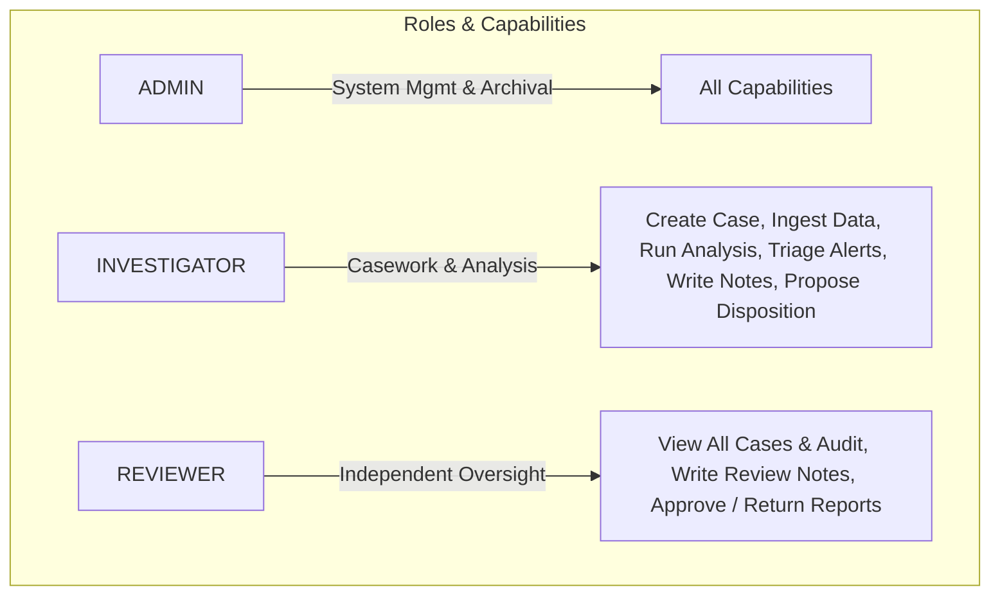

# ObsidianChain — Security, RBAC & Audit Integrity
**Problem Statement 26146: AI-Powered Monitoring & Analysis of Bitcoin Transaction Traffic**  
**Repository Layer:** `docs/SECURITY_AND_RBAC.md` (Access Control, Cryptographic Integrity & Offline Assurance)

---

## 1. Security Architecture Principles

ObsidianChain is engineered for high-security, air-gapped environments. The platform operates completely offline without external network egress, telemetry reporting, or cloud authentication services.

Security in ObsidianChain rests on five foundational pillars:
1. **Zero External Dependencies at Runtime:** The container runs with `--network none`. Authentication, cryptography, and analytical inference execute entirely within local processes.
2. **Explicit, Code-Enforced RBAC:** Permissions are defined in code constants, preventing runtime privilege drift or database-injection escalation.
3. **Dual-Control Forensic Oversight:** Casework requires separation of duties between case investigators and independent reviewers.
4. **Append-Only Cryptographic Audit Trails:** Every state mutation produces an immutable audit record.
5. **Tamper-Evident Merkle Bundles:** Case exports provide cryptographic inclusion proofs over all evidence, notes, and dispositions.

> [!NOTE]
> **Legal Notice:** Cryptographic integrity proofs and Merkle verification provide tamper-evident assurance within the platform. They do not constitute formal government security certification or automated chain-of-custody warranty under statutory evidentiary rules.

---

## 2. Authentication & Password Security

### Password Hashing (`passwords.py`)
- **Algorithm:** Standard-library `scrypt` (`hashlib.scrypt`).
- **Interactive Profile Parameters:**
  - $N = 2^{15} = 32,768$ (CPU / memory cost factor)
  - $r = 8$ (Block size factor)
  - $p = 1$ (Parallelization factor)
  - Salt Length: 16 bytes (`secrets.token_bytes(16)`)
  - Key Length: 32 bytes
- **Encoding Scheme:** `scrypt$32768$8$1$<salt_hex>$<hash_hex>`
- **Why `scrypt` Was Chosen Over `bcrypt` or `Argon2`:**  
  ObsidianChain builds in strictly offline environments from a vendored wheel repository. `hashlib.scrypt` ships with CPython against system OpenSSL, requiring zero external C-extensions or third-party wheels while providing robust resistance to GPU/ASIC-accelerated offline dictionary attacks.

### Session Management (`sessions.py`)
- Authentication creates an ephemeral bearer session stored in SQLite.
- Session tokens are generated using cryptographically secure random bytes (`secrets.token_hex(32)`).
- Sessions are strictly validated on every HTTP request and can be revoked instantly upon logout.

---

## 3. Role-Based Access Control (RBAC)

RBAC policies are defined in [`src/obsidianchain/console/rbac.py`](file:///Users/varun/dev/obsidianchain/src/obsidianchain/console/rbac.py).

### The Three Institutional Roles



| Capability | Investigator | Reviewer | Admin |
| :--- | :---: | :---: | :---: |
| `manage_users` | ❌ | ❌ | ✅ |
| `view_all_investigations` | ❌ (Own cases only) | ✅ | ✅ |
| `view_all_audit` | ❌ | ✅ | ✅ |
| `create_investigation` | ✅ | ❌ | ✅ |
| `edit_investigation` | ✅ (Own cases only) | ❌ | ✅ |
| `change_investigation_status` | ✅ (Workflow states) | ❌ | ✅ |
| `archive_investigation` | ❌ | ❌ | ✅ |
| `upload_dataset` | ✅ | ❌ | ✅ |
| `bind_analytical_run` | ✅ | ❌ | ✅ |
| `reference_alert` / `set_disposition` | ✅ | ❌ | ✅ |
| `write_note` | ✅ (Own cases) | ✅ (Any case) | ✅ |
| `review_investigation` | ❌ | ✅ | ✅ |
| `finalise_report` | ❌ | ✅ | ✅ |

### Separation of Duties (Why Reviewer Cannot Mutate Dispositions)
A reviewer exists so that investigative conclusions are never signed only by their author. Reviewers can read every case, view all evidence, and add independent review notes. However, **reviewers cannot create cases, upload data, or overwrite investigator dispositions**. A reviewer who could silently rewrite an investigator's work would undermine investigative accountability.

---

## 4. Case Isolation & Lifecycle Enforcement

- **Case Read Isolation:** An investigator can only view cases they own (`may_read_case()`). Administrators and reviewers have oversight across all cases.
- **Case Write Isolation:** Only the owning investigator (or administrator) may mutate case details, attach alerts, or record dispositions (`may_write_case()`).
- **Reviewer Exemption for Notes:** Reviewers are explicitly granted permission to append review notes to other users' cases (`may_write_note()`), ensuring that review rationale is permanently attached alongside the case history without altering the investigator's recorded findings.
- **State Machine Transitions:** Status changes are strictly validated against `TRANSITIONS` in `investigations.py`. Unauthorized status jumps (e.g., jumping from `DRAFT` directly to `APPROVED`) are rejected with `409 Conflict`.

---

## 5. Append-Only Audit Trail (`audit.py`)

Every security-sensitive or casework action writes a durable event into the `audit_events` SQLite table:
- **Recorded Fields:** `id`, `actor_id`, `action`, `object_type`, `object_id`, `investigation_id`, `created_at`, `detail` (JSON payload).
- **Core Audited Actions:**
  - User authentication and session creation / termination.
  - Case creation, updates, and status transitions.
  - Dataset upload, validation, and analytical run binding.
  - Alert assignment, disposition changes, and note attachments.
  - Report draft generation and reviewer sign-off.
  - Case archival and unarchival.
- **Immutability:** The audit table does not expose update or delete endpoints. Audit records persist permanently for compliance review.

---

## 6. Merkle Case-Integrity & Tamper Evidence (`integrity.py`)

When an investigation dossier or report is exported, ObsidianChain constructs a domain-separated Merkle tree over all constituent artifacts:

```
                  [Merkle Root]
                 /             \
         [Branch 0x01]     [Branch 0x01]
          /         \       /         \
       Leaf       Leaf    Leaf       Leaf
      (Alert)   (Evidence)(Note)  (Report)
       0x00       0x00    0x00      0x00
```

### Cryptographic Guarantees
1. **Domain Separation:**
   - Leaf Nodes: Prefix `0x00` prepended to canonical JSON byte payload before hashing.
   - Internal Branch Nodes: Prefix `0x01` prepended to concatenated child hashes (`left || right`). Prevents second-preimage attacks.
2. **Deterministic Canonical JSON:** Keys are sorted deterministically before hashing, ensuring byte-level platform reproducibility across architectures.
3. **Inclusion Proofs:** Any individual alert, note, or piece of evidence can be independently proven to belong to the exported Merkle root via $O(\log N)$ sibling hashes.
4. **Anti-Circular Hashing:** The Merkle root is computed over finalized case data before the container manifest is signed, preventing circular hash dependencies.
5. **Export Header:** Export downloads include the `X-Bundle-SHA256` HTTP header, allowing immediate verification against downloaded payloads.

---

## 7. Air-Gapped / Offline Assurance

- **Zero Network Egress:** Production backend (`uvicorn`) and frontend assets bind strictly to local interfaces (`127.0.0.1`).
- **Vendored Dependencies:** Python dependencies are vendored locally in `vendor/` wheels; frontend libraries are bundled via Vite without dynamic CDN script tags.
- **Local GeoIP & Reference Data:** ASN and GeoIP lookups use local static reference databases (`data/reference/`) without external WHOIS or DNS lookups.
