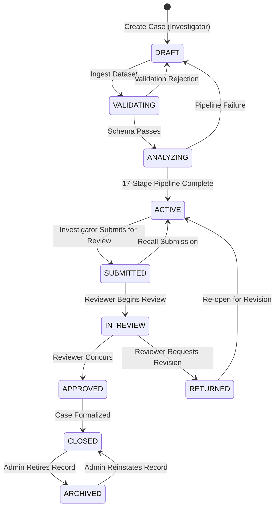

# ObsidianChain — End-to-End System Workflow
**Problem Statement 26146: AI-Powered Monitoring & Analysis of Bitcoin Transaction Traffic**  
**Repository Layer:** `docs/SYSTEM_WORKFLOW.md` (Operational Casework, Analytical Lifecycle & Reviewer Sign-Off)

---

## 1. Overview

ObsidianChain guides institutional investigators through an evidence-based forensic casework lifecycle. The system enforces strict accountability: analytical predictions prioritize where investigators look, while all formal conclusions require verifiable evidence, investigator rationale, reviewer sign-off, and cryptographic audit proofs.

---

## 2. Investigation Lifecycle State Machine

Investigations transition through deterministic, role-restricted states:

| Lifecycle State | Description | Authorized Roles | Permitted Next States |
| :--- | :--- | :--- | :--- |
| `DRAFT` | Case record initialized; awaiting dataset upload. | `INVESTIGATOR`, `ADMIN` | `VALIDATING`, `CLOSED` |
| `VALIDATING` | Uploaded CSV/JSON/XML undergoing schema and format validation. | Automated / System | `ANALYZING`, `DRAFT`, `CLOSED` |
| `ANALYZING` | 17-stage analytical pipeline executing over validated transaction data. | Automated / System | `ACTIVE`, `DRAFT` |
| `ACTIVE` | Analysis complete; investigator triaging alerts, graphing flows, taking notes. | `INVESTIGATOR`, `ADMIN` | `SUBMITTED`, `CLOSED` |
| `SUBMITTED` | Investigator completed dossier; submitted to review queue. | `INVESTIGATOR`, `ADMIN` | `IN_REVIEW`, `ACTIVE` |
| `IN_REVIEW` | Independent reviewer evaluating evidence, dispositions, and notes. | `REVIEWER`, `ADMIN` | `APPROVED`, `RETURNED` |
| `RETURNED` | Reviewer requested further evidence or clarification before sign-off. | `REVIEWER`, `ADMIN` | `ACTIVE` |
| `APPROVED` | Reviewer approved forensic findings; report finalized. | `REVIEWER`, `ADMIN` | `CLOSED` |
| `CLOSED` | Active casework finished; records locked. | `INVESTIGATOR`, `ADMIN` | `ACTIVE`, `ARCHIVED` |
| `ARCHIVED` | Historical cold storage; preserved for compliance and audit. | `ADMIN` | `CLOSED`, `ACTIVE` |

---

## 3. The 19-Step Investigative Casework Workflow

### Phase I: Authentication & Case Initialization
1. **Login & Session Establishment**  
   The investigator authenticates via `/api/auth/login`. Credentials are verified against standard-library `scrypt` password hashes (`passwords.py`). The server issues an ephemeral bearer session token and verifies the user's role (`INVESTIGATOR`, `REVIEWER`, or `ADMIN`).
2. **Create Investigation**  
   The investigator creates a case (e.g., `OC-0001`) via `/api/console/investigations`. An audit log entry is recorded with actor ID, timestamp, and unique case identifier. The case enters `DRAFT` state.

### Phase II: Data Ingestion, Validation & Analytical Execution
3. **Upload Dataset**  
   The investigator uploads transaction and network metadata via `/api/console/datasets/upload`. Supported formats include CSV, JSON, and XML.
4. **Schema Validation & Deduplication**  
   `obsidianchain.io.ingest` normalizes records against `CANONICAL_COLUMNS`, computes an immutable SHA-256 fingerprint over the dataset payload, and verifies required fields (`txid`, amounts, timestamps). A `ValidationReport` records missing, coerced, or rejected rows without silent imputation.
5. **Configure & Run Analysis**  
   The investigator binds the dataset and triggers analytical execution. The investigation transitions to `VALIDATING` and then `ANALYZING`.
6. **Execution of the 17-Stage Pipeline**  
   The conductor (`pipeline.orchestrator`) executes 17 deterministic stages:
   - **Stage 1: Ingest** — Ingests canonical raw records into memory.
   - **Stage 2: Validate & Deduplicate** — Strips duplicate txid records and validates timestamps.
   - **Stage 3: GeoIP / ASN Provider** — Resolves autonomous system numbers and IP locations offline.
   - **Stage 4: Blockchain Analysis** — Computes transaction volumes, input/output counts, and fee distributions.
   - **Stage 5: Network Analysis** — Analyzes peer announcement delays and vantage points.
   - **Stage 6: Blockchain ↔ Network Correlation** — Joins network telemetry with blockchain transactions on `txid`.
   - **Stage 7: Blockchain Transaction Graph** — Constructs directed graph edges between addresses and transactions.
   - **Stage 8: Entity Clustering** — Executes Union-Find multi-input clustering with path compression and union-by-rank.
   - **Stage 9: Features & Compatibility Check** — Extracts 30 core features as-of timestamp $t$ and validates model compatibility.
   - **Stage 10: Supervised ML Risk** — Computes risk predictions via the frozen Random Forest model and applies isotonic calibration.
   - **Stage 11: Unsupervised Anomaly Scoring** — Computes Median Absolute Deviation (MAD) robust Z-scores per address.
   - **Stage 12: Peeling & Mixing Patterns** — Identifies rapid peeling chains and equal-output mixing candidates.
   - **Stage 13: Evidence Fusion** — Combines ML risk, MAD anomalies, structural heuristics, and network context into evidence packages.
   - **Stage 14: Ranked Alerts** — Ranks entity clusters by calibrated risk and aggregates them into severity bands (`CRITICAL`, `HIGH`, `MEDIUM`).
   - **Stage 15: Forensic Explanations** — Formulates explainable factor breakdowns separating model signals from ledger facts.
   - **Stage 16: Investigation Graph Projection** — Pre-computes 2-hop subgraphs and counterparty relationships for UI rendering.
   - **Stage 17: Reporting & Run Integrity Manifest** — Generates execution fingerprints and writes the immutable run manifest.  
   Upon completion, the case moves to `ACTIVE`.

### Phase III: Triage & Forensic Examination
7. **Alert Queue Triage**  
   The investigator reviews prioritized entities in the Alert Queue. Entities are sorted by calibrated risk score, display clear severity badges, and state the primary risk driver.
8. **Inspect Alert Detail**  
   Selecting an alert opens the comprehensive forensic dossier displaying entity metadata, cluster size, first/last seen timestamps, and total transactional volume.
9. **"Why Flagged" Forensic Breakdown**  
   The investigator inspects the explainability panel. Factor breakdowns clearly distinguish:
   - `MODEL_SIGNAL`: Statistically derived risk score contributions.
   - `BLOCKCHAIN_CONTEXT`: On-chain transactional facts (fees, transaction counts, velocities).
   - `NETWORK_CONTEXT`: Observed peer announcement dynamics.
   - `INSUFFICIENT_EVIDENCE`: Explicit notation when features cannot be computed.
10. **Evidence Dossier**  
    The investigator inspects the evidentiary funnel: multi-input co-spend merges, peeling structures, and volume spikes.
11. **Forensic Transaction Graph**  
    The interactive SVG visualizer renders the entity cluster, connected transactions, and 2-hop counterparty flows, allowing visual verification of rapid fund dispersal or peeling loops.
12. **Activity Timeline**  
    The chronological timeline table displays transaction history, highlighting burst velocity, dormancy gaps, and temporal spikes.
13. **Network Telemetry & Vantage Breakdown**  
    The investigator reviews peer IP announcements and observer diversity. The UI displays prominent evidentiary caveats: network observations provide propagation context, not proof of private key ownership or sender identity.

### Phase IV: Casework Decisions & Review
14. **Investigator Notes & Dispositions**  
    The investigator attaches formal notes and assigns an investigative disposition (`ESCALATED`, `MONITORING`, `RESOLVED_BENIGN`, `INCONCLUSIVE`). Each entry is timestamped and cryptographically hashed into the case ledger.
15. **Submit for Review**  
    The investigator transitions the case to `SUBMITTED`. The case is locked against further modification by the investigator.
16. **Reviewer Evaluation**  
    An independent reviewer (holding the `REVIEWER` role) examines the case (`IN_REVIEW`). The reviewer validates that the evidence supports the disposition. Reviewers cannot rewrite investigator findings; they attach independent review notes and decide whether to `APPROVE` or `RETURN` the dossier.
17. **Formal Case Report Generation**  
    Upon approval, a formal report is generated (`DRAFT` $\to$ `FINAL`). The report records all cluster attributes, evidence citations, disposition history, and dual investigator/reviewer sign-offs.

### Phase V: Closure, Archival & Tamper-Evident Integrity
18. **Close & Archive Case**  
    The case transitions to `CLOSED`. An administrator can subsequently move the case to `ARCHIVED` for cold storage.
19. **Audit Log & Merkle Integrity Verification**  
    Every casework action generates an append-only audit event in `audit.py`. When exporting a case dossier, the system generates a domain-separated Merkle tree over all alerts, evidence, notes, and reports (`integrity.py`). The exported JSON bundle includes the Merkle root, leaf inclusion proofs, and an `X-Bundle-SHA256` HTTP header, ensuring tamper-evident verification for judicial review or oversight.
