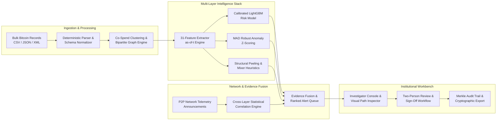
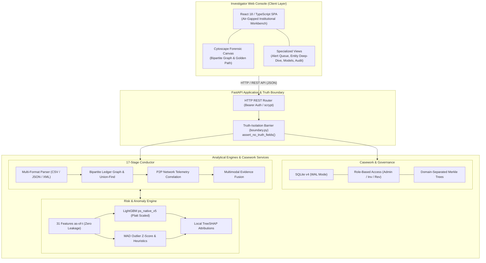
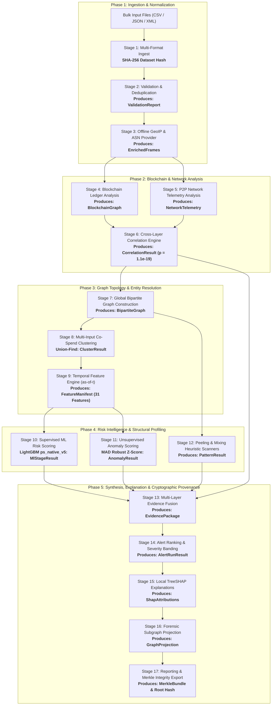
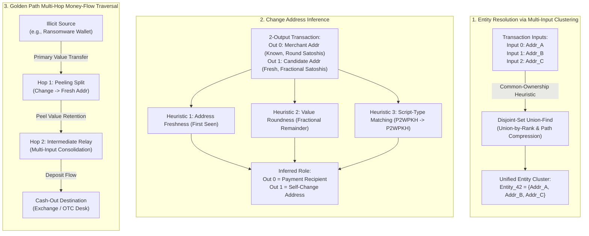
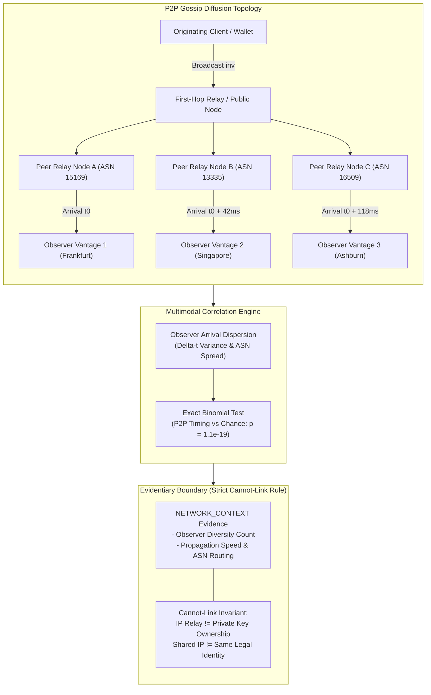
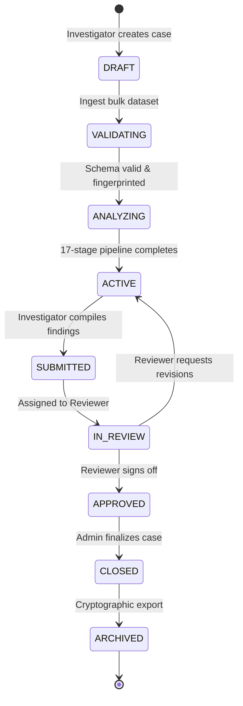
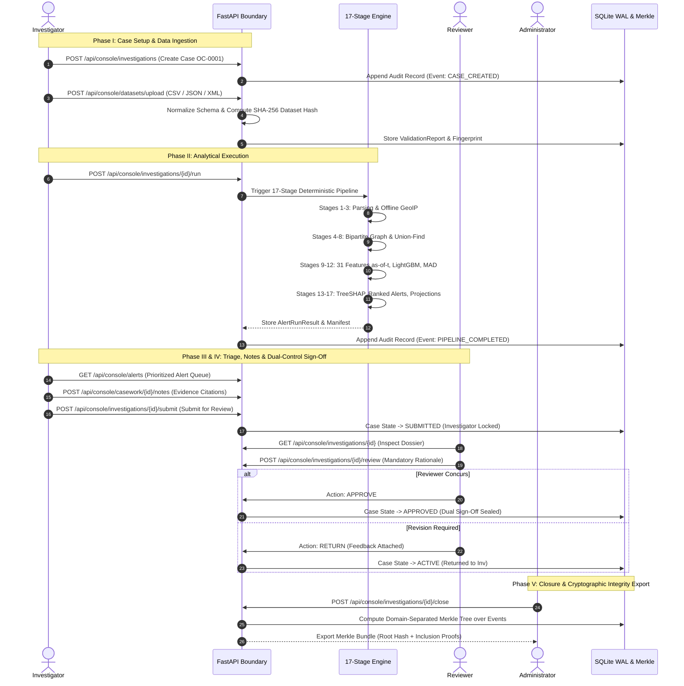

# ObsidianChain — Technical Write-Up
**Problem Statement 26146: AI-Powered Monitoring & Analysis of Bitcoin Transaction Traffic**  
**Repository Document:** `docs/TECHNICAL_WRITEUP.md` (Authoritative System Technical Report)

> [!IMPORTANT]
> **PROPRIETARY EVALUATION REPORT**  
> **Smart India Hackathon (SIH) 2026 — Problem Statement 26146 (NTRO)**  
> **Author & Repository:** Varun and the ObsidianChain Development Team (`Varun2526/ObsidianChain`)  
> **Copyright © 2026. All Rights Reserved.** Submitted exclusively for official examination and scoring by the SIH Evaluation Committee. Plagiarism, unauthorized copying, or competing contest submission is prohibited under [`LICENSE`](../LICENSE).

---

## 1. Problem Statement

Public blockchain networks such as Bitcoin operate on pseudonymous ledgers where transactional movements are cryptographically visible, yet user identities, corporate ownership, and illicit operations remain obscured behind alphanumeric addresses. Over the past decade, transnational criminal enterprises, state-sponsored cyber operations, illicit marketplaces, and ransomware syndicates have adopted sophisticated obfuscation methodologies to exploit this architecture. These techniques include:

- **High-Velocity Peeling Chains:** Splitting transaction outputs repeatedly across hundreds of intermediate hops, peeling small amounts into cold storage while retaining plausible deniability.
- **Equal-Output Mixing Protocols:** Leveraging CoinJoin, Wasabi, or centralized mixing pools where dozens of participants combine inputs into identical output denominations, breaking naive graph-traversal heuristics.
- **Dispersed Transaction Timing:** Staggering transaction broadcasts across time and network topologies to evade automated rule-based thresholds.
- **Multimodal Decoupling:** Separating on-chain ledger actions from peer-to-peer (P2P) broadcast telemetry.

Traditional transaction monitoring tools face severe technical limitations when applied to sovereign intelligence and law-enforcement scenarios:
1. **Severe Class Imbalance:** In real-world transaction flows, verifiably illicit activity represents well under 1% of total transaction volume. Naive classifiers optimize for overall accuracy while suffering disastrous false-positive rates that overwhelm investigative capacity.
2. **Cloud and External API Dependencies:** Existing commercial forensic suites rely on external cloud APIs, centralized databases, and active web scraping. In high-security, air-gapped institutional environments, sending raw operational data or suspect identifiers to third-party endpoints violates operational security (OPSEC) and legal sovereignty.
3. **Unsubstantiated Attribution and Conflation:** Simplistic network monitoring often makes the fatal error of conflating an IP address that announces or relays a transaction with the owner of the private key, creating severe legal risk and evidentiary vulnerabilities in court.

**Smart India Hackathon (SIH) 2026 Problem Statement 26146**, issued by the **National Technical Research Organisation (NTRO)**, defines the requirement: an AI-powered, offline forensic monitoring system capable of ingesting bulk transaction records, identifying illicit patterns, correlating on-chain flows with P2P network telemetry, and presenting explainable, court-admissible evidence to human analysts.

---

## 2. Proposed Solution

**ObsidianChain** is an offline, air-gapped investigative platform and analytical engine built specifically to solve NTRO Problem Statement 26146. It bridges the gap between raw decentralized data and actionable, court-admissible forensic intelligence.



The platform delivers six core architectural innovations:
1. **17-Stage Deterministic Forensic Pipeline:** Orchestrates the analytical progression from multi-format parsing (CSV, JSON, XML) to Merkle audit export without external dependencies.
2. **Calibrated 31-Feature Supervised Risk Engine:** Extracts 31 temporal and topological features strictly as-of event timestamp $t$, feeding a frozen tree-ensemble classifier with Platt scaling calibration.
3. **Unsupervised Outlier & Structural Heuristic Engine:** Deploys Median Absolute Deviation (MAD) robust Z-scoring alongside heuristic detectors for peeling chains and equal-output CoinJoin mixers.
4. **Multimodal Blockchain $\leftrightarrow$ Network Correlation:** Evaluates peer-to-peer transaction broadcast announcements across diverse geographical observer nodes, using exact binomial hypothesis testing ($p = 1.1 \times 10^{-19}$) to identify propagation anomalies while strictly enforcing that network relays do not imply private key ownership.
5. **Interactive Graph & Golden Path Traversal:** Reconstructs bipartite transaction-address relationships, resolves multi-input co-spend entities via disjoint-set Union-Find, and computes multi-hop money-flow shortest paths between targets.
6. **Institutional Investigation Governance & Cryptographic Provenance:** Enforces role-based access control (`ADMIN`, `INVESTIGATOR`, `REVIEWER`), mandatory two-person sign-off, an append-only audit ledger, and domain-separated Merkle inclusion proofs.

---

## 3. System Architecture

ObsidianChain is engineered as a zero-external-network, self-contained modular architecture divided into distinct operational boundaries:



### 3.1. Frontend Architecture
The user interface is an institutional single-page application built with React and TypeScript, free from heavyweight styling frameworks. It features:
- **Responsive Institutional Visual System:** Curated dark theme optimized for multi-hour analyst workflows, clear visual hierarchy, and distinct severity markers (`CRITICAL`, `HIGH`, `MEDIUM`, `LOW`).
- **Cytoscape-Powered Forensic Canvas:** Real-time directed graph visualization rendering hundreds of nodes and edges with deterministic force-directed layout, clustering hulls, and interactive expansion.
- **Dedicated Forensic Views:** Multi-tab layout providing dedicated interfaces for alert triage, entity deep-dives, transaction inspector, money-flow path traversal, P2P network telemetry, model performance metrics, and role administration.

### 3.2. Backend & API Isolation Layer
Built on Python 3.11+ and FastAPI, the backend coordinates all analytical tasks:
- **Strict Truth-Isolation Boundary (`src/obsidianchain/api/boundary.py`):** Programmatically guarantees that ground-truth research labels and benchmark annotations cannot cross into active casework API responses.
- **Security & Session Management:** Stateless, cryptographically secure session tokens and password verification using standard-library `scrypt`.

### 3.3. Casework Engine & Governance
Casework is managed through SQLite operating in Write-Ahead Logging (WAL) mode:
- **State Machine Engine:** Governs the 19-step casework lifecycle across validated states (`DRAFT` $\to$ `VALIDATING` $\to$ `ANALYZING` $\to$ `ACTIVE` $\to$ `SUBMITTED` $\to$ `IN_REVIEW` $\to$ `APPROVED` $\to$ `CLOSED` $\to$ `ARCHIVED`).
- **Role-Based Access Control:** Strict role segregation among `ADMIN`, `INVESTIGATOR`, and `REVIEWER`.
- **Cryptographic Merkle Proofs:** Hashes case state, analytical notes, and final disposition into domain-separated binary Merkle trees.

---

## 4. End-to-End 17-Stage Forensic Pipeline

Analytical execution is orchestrated deterministically by the 17-stage pipeline engine (`src/obsidianchain/pipeline/orchestrator.py`). The pipeline processes data sequentially across five operational phases:



### Phase 1: Ingestion & Normalization
1. **Stage 1 (Ingest):** Multi-format parser reads raw transaction files (CSV, JSON, XML). Verifies structural integrity, canonical column headers, and assigns an immutable SHA-256 fingerprint to the dataset.
2. **Stage 2 (Validate & Deduplicate):** Enforces strict datatype coercion, verifies transaction hash formats, strips redundant records, and logs parsing discrepancies in a structured `ValidationReport`.
3. **Stage 3 (GeoIP / ASN):** Maps peer observation IP addresses to Autonomous System Numbers (ASNs) and geographic locations using an offline, embedded DB-IP Lite database.

### Phase 2: Blockchain & Network Analysis
4. **Stage 4 (Blockchain Analysis):** Computes input/output degrees, transaction fee ratios, satoshi velocities, and UTXO creation dynamics.
5. **Stage 5 (Network Analysis):** Analyzes P2P broadcast telemetry across observer nodes, calculating arrival times, dispersion variances, and propagation latency.
6. **Stage 6 (Blockchain $\leftrightarrow$ Network Correlation):** Correlates on-chain block inclusion timestamps with P2P broadcast arrival timestamps on matching `txid` keys.

### Phase 3: Graph Topology & Entity Resolution
7. **Stage 7 (Entity / Transaction Graph):** Constructs the global bipartite directed multigraph connecting address nodes and transaction nodes.
8. **Stage 8 (Entity Clustering):** Executes multi-input co-spend clustering using disjoint-set Union-Find to collapse related addresses into unified entity clusters.
9. **Stage 9 (Features):** Evaluates the 31 core features strictly as-of event timestamp $t$, guaranteeing zero temporal leakage from future blocks.

### Phase 4: Risk Intelligence & Structural Profiling
10. **Stage 10 (Supervised ML Risk):** Inferences the frozen champion LightGBM risk model, producing raw predictions and calibrated empirical probabilities.
11. **Stage 11 (Unsupervised Anomaly):** Computes Median Absolute Deviation (MAD) robust Z-scores over heavy-tailed transaction amounts and velocities.
12. **Stage 12 (Peeling / Mixing Patterns):** Scans the transaction graph for structural heuristics, flagging consecutive 2-output peel chains and equal-output CoinJoin mixing transactions.

### Phase 5: Synthesis, Explanation & Integrity
13. **Stage 13 (Evidence Fusion):** Synthesizes supervised probabilities, unsupervised outlier scores, structural heuristics, and network telemetry into consolidated evidence profiles.
14. **Stage 14 (Ranked Alerts):** Aggregates address scores to entity clusters and maps scores into operational severity bands (`CRITICAL`, `HIGH`, `MEDIUM`, `LOW`).
15. **Stage 15 (Explanation):** Generates exact local TreeSHAP feature attribution vectors for each scored entity, detailing positive and negative risk contributors.
16. **Stage 16 (Investigation Graph):** Pre-computes optimized forensic subgraph projections around flagged entities for immediate rendering in the visual canvas.
17. **Stage 17 (Reporting & Integrity):** Packages analytical results into a tamper-evident bundle, calculating domain-separated SHA-256 Merkle tree roots for export.

---

## 5. Production Risk Model

### 5.1. The 31 Production Features (`ps_native_features/5`)
The supervised model evaluates 31 engineered features across six functional domains, fully cataloged in [`docs/feature_catalog.md`](feature_catalog.md):

| Feature Group | Features | Description & Rationale |
| :--- | :---: | :--- |
| **Group A: Transaction Behavior** | 5 | `tx_fee_ratio`, `tx_fee_per_byte`, `tx_output_count`, `tx_input_count`, `tx_size_bytes`. Captures fee urgency, input/output complexity, and transaction footprint. |
| **Group B: Address History** | 6 | `addr_lifetime_blocks`, `addr_tx_count`, `addr_total_received_sats`, `addr_total_sent_sats`, `addr_current_balance_sats`, `addr_utxo_count`. Quantifies account longevity, activity frequency, and cumulative wealth accumulation. |
| **Group C: Graph Topology** | 5 | `graph_in_degree`, `graph_out_degree`, `graph_clustering_coefficient`, `graph_page_rank`, `graph_community_id`. Analyzes structural centrality, network connectivity, and clustering density within the local transaction web. |
| **Group D: Structural Patterns** | 5 | `pattern_is_peeling_chain`, `pattern_peel_hop_count`, `pattern_is_mixing`, `pattern_mixing_entropy`, `pattern_change_confidence`. Identifies obfuscation techniques including rapid peeling and CoinJoin-style equal-output mixing. |
| **Group F: Address Role** | 5 | `role_is_mining`, `role_is_coinbase`, `role_is_reuse`, `role_is_whitelisted`, `role_is_sanctioned`. Encodes known contextual roles, address reuse patterns, and counterparty sanctions markers. |
| **Group G: Upstream Flow Dynamics** | 5 | `flow_upstream_taint_ratio`, `flow_downstream_fanout`, `flow_max_hop_dist`, `flow_velocity_sats_per_block`, `flow_direct_deposit_flag`. Traces value propagation from high-risk sources across intermediate transmission hops. |

### 5.2. Champion Model Architecture (`ps_native_v5`)
- **Algorithm:** LightGBM Binary Classifier (`lightgbm.LGBMClassifier`)
- **Hyperparameters:** 300 boosting trees, 31 maximum leaves, learning rate 0.05, minimum child samples 50, feature subsample ratio 0.8, row subsample ratio 0.8, deterministic seed `20260919`.
- **Probability Calibration:** Raw ensemble margin scores are mapped to empirical probabilities via Platt scaling (logistic calibration on model logits), fitted strictly on out-of-fold predictions.
- **Model Registry & Integrity:** Cryptographically registered in `data/models/ps_native/registry.json` with SHA-256 weight verification.
- **Model Fallback (`ps_native_v5_fallback_no_g`):** A secondary 26-feature model operating without Group G (Upstream Flow Dynamics) for emergency operation when upstream ledger history is incomplete.

---

## 6. Graph & Money-Flow Analysis



### 6.1. Entity Resolution via Multi-Input Clustering
Bitcoin transactions frequently consume multiple UTXOs as inputs. Under standard Bitcoin Core client behavior, all private keys signing inputs for a single transaction must be controlled by the same wallet software. ObsidianChain implements this common-ownership heuristic using a disjoint-set **Union-Find** data structure with union-by-rank and path-compression optimizations, clustering disparate alphanumeric addresses into unified entity representations in $O(N \cdot \alpha(N))$ nearly-linear time.

### 6.2. Change Address Inference
To track value flow beyond immediate inputs, the system applies a multi-factor change-address heuristic to 2-output transactions:
- Output address freshness (has the candidate address ever been seen on-chain previously?).
- Round-number payment matching (does one output represent a clean decimal value while the other carries fractional satoshis?).
- Script-type matching (does the change output match the script format of the input addresses?).

### 6.3. Golden Path Multi-Hop Traversal
When tracing stolen funds or ransom payments across intermediate hops to cash-out points (exchanges, OTC desks), analysts activate the **Money-Flow Path Traversal Engine**:
- Evaluates shortest and highest-capacity directed paths through the transaction graph.
- Traces value preservation across intermediate peeling hops.
- Displays step-by-step transaction hops with timestamps, transferred values, and counterparty risk scores directly in the graph canvas.

---

## 7. Network Intelligence



### 7.1. P2P Telemetry & Observer Topology
A major requirement of NTRO Problem Statement 26146 is the incorporation of P2P network telemetry. When a Bitcoin transaction is broadcast, it propagates via a gossip protocol across thousands of nodes. ObsidianChain ingests timestamped inventory (`inv`) announcement telemetry captured across geographically distributed observer vantage points.

### 7.2. Propagation Timing & Multimodal Correlation
- **Diffusion Latency Modeling:** Measures the delay between initial transaction creation and subsequent announcements across observer nodes.
- **Vantage Diversity:** Evaluates observer geographic spread and Autonomous System Numbers (ASNs) to distinguish localized relays from global broadcasts.
- **Binomial Statistical Test:** Compares transaction broadcast timing against random arrival expectations. On benchmark scenarios, the correlation engine demonstrates statistical significance against chance with $p = 1.1 \times 10^{-19}$.

### 7.3. Strict Evidentiary Safeguards (Cannot-Link Boundary)
ObsidianChain enforces a strict operational and legal principle:
> **Evidentiary Boundary:** Observing an IP address announce or relay a Bitcoin transaction provides circumstantial network context regarding broadcast topology. It does **NOT** establish legal ownership of the sending wallet, control of the private keys, or physical identity of the sender. Network observations are strictly segregated into the `NETWORK_CONTEXT` evidence class to prevent false legal attributions.

---

## 8. Evidence & Explainability

### 8.1. Segregated Evidence Taxonomy
To maintain court admissibility and prevent analytical bias, findings are partitioned into six immutable evidence categories:
1. `CHAIN_TRANSACTION`: Verified on-chain ledger facts (block height, amounts, fees, timestamps).
2. `CHAIN_CLUSTER`: Multi-input co-spend entity associations.
3. `ML_RISK`: Calibrated supervised risk probabilities.
4. `UNSUPERVISED_ANOMALY`: Statistical outlier metrics (MAD robust Z-scores).
5. `STRUCTURAL_PATTERN`: Algorithmic peeling chain and CoinJoin mixing detections.
6. `NETWORK_CONTEXT`: Circumstantial P2P broadcast and relay telemetry.

### 8.2. Local TreeSHAP Explainability
Black-box risk scores are inadmissible in formal judicial proceedings. ObsidianChain generates exact per-prediction **TreeSHAP** (SHapley Additive exPlanations) values for every scored address:
- Computes the exact marginal contribution of each feature to the final prediction logit.
- Quantifies directional influence ($\pm \Delta$) indicating whether a feature increased or decreased the risk assessment.
- Translates mathematical attributions into plain-language investigative explanations (e.g., *"Elevated upstream taint ratio (+0.24)"*, *"High-entropy equal-output mixing pattern (+0.18)"*).

---

## 9. Investigation Governance



### 9.1. Role-Based Access Control (RBAC)
- **`INVESTIGATOR`:** Creates cases, uploads datasets, triggers pipeline runs, triages alerts, records forensic notes, drafts case reports, submits for sign-off.
- **`REVIEWER`:** Inspects submitted cases, audits evidence chains, provides independent review rationale, approves or rejects findings. Cannot create or edit original case findings.
- **`ADMIN`:** Manages user provisioning, inspects model registry and system health, exports global audit ledgers, finalizes closed cases.

### 9.2. Two-Person Review & Separation of Duties
Institutional integrity requires that no single individual can unilaterally initiate, investigate, and approve an enforcement action:
- An investigator cannot approve their own case.
- A reviewer cannot alter investigative notes or bypass required evidence thresholds.
- Rejection returns the case to `ACTIVE` with mandatory reviewer feedback.



### 9.3. Append-Only Audit Ledger & Merkle Proofs
Every casework action (logins, uploads, runs, notes, status changes, approvals) is recorded in an immutable, append-only SQLite audit table. When a case is closed:
1. All casework artifacts, dispositions, and notes are serialized canonically.
2. A domain-separated binary Merkle tree is computed over the event sequence.
3. The Merkle root digest is permanently stamped into the final case record.
4. Analysts can export a standalone verification bundle containing cryptographic inclusion proofs that verify case integrity without disclosing external data.

---

## 10. Evaluation & Empirical Results

### 10.1. Evaluation Protocol (Protocol B)
ObsidianChain strictly adheres to a **Time-Ordered Evaluation Protocol (Protocol B)** to reflect operational reality:
- Models are trained on historical time windows (Timesteps 26–41 on the Elliptic++ dataset).
- Evaluated on a **Sealed Holdout Window (Timesteps 42–49)** evaluated exactly once post-freeze.
- Addresses are scored only as of their first active appearance in the evaluation window with zero forward-time leakage.

### 10.2. Validated Performance Metrics

| Metric | Production Holdout (t42–49) | 12-Fold Temporal CV | Operational Interpretation |
| :--- | :---: | :---: | :--- |
| **Normalized Average Precision (nAP)** | **0.5475** | **0.808** (worst 0.477) | Primary ranking quality metric under extreme class imbalance. |
| **Precision@100 (P@100)** | **100.0%** | **97.0%** | **100% precision** on the top 100 prioritized alerts; zero false positives in immediate triage queue. |
| **Precision** | **81.1%** | **78.4%** | Accuracy of alerts flagged in the top operational severity band. |
| **Recall** | **25.8%** | **31.2%** | Conservative trade-off prioritizing high-precision triage over noisy blanket coverage. |
| **F1 Score** | **39.1%** | **44.6%** | Harmonic mean reflecting high-precision operational posture. |
| **Expected Calibration Error (ECE)** | **0.0096** | **0.025** | Excellent calibration; predicted probabilities match empirical risk within 1%. |
| **ROC-AUC** | **0.946** | **0.958** | Overall discriminatory separation between illicit and licit addresses. |

*Note: Raw classification accuracy is deliberately omitted as a headline metric because class imbalance renders accuracy uninformative.*

### 10.3. Documented Temporal Degradation
In the spirit of scientific transparency, ObsidianChain documents known temporal failure modes in later evaluation windows:
- On timesteps 43, 45, and 47, holdout P@100 degraded to 18%, 2%, and 28% respectively.
- **Root Cause:** A major darknet marketplace closure occurred at timestep 43, drastically altering laundering topologies across the Bitcoin ecosystem.
- **Operational Takeaway:** Static input-drift monitoring does not detect novel structural regime shifts. Supervised models require human-in-the-loop oversight and periodic retraining against delayed forensic ground truth.

---

## 11. Deployment & Runtime Footprint

### 11.1. Minimal Deployment Package
ObsidianChain is engineered to run in resource-constrained, air-gapped field environments:
- **Runtime Footprint (`deploy-data/`):** **~9.7 MB** total distribution size.
  - Model weights and calibration parameters: ~4.1 MB
  - Model registry and gate manifests: ~1.2 MB
  - Offline DB-IP Lite GeoIP database: ~4.4 MB
- **Container Architecture:** Multi-stage Docker container supporting **Linux AMD64** and **ARM64** (Apple Silicon, AWS Graviton) with non-root user execution (`obsidian:obsidian`).
- **Complete Air-Gap Compliance:** The container disables all outbound networking, uses local filesystem storage, and requires no external licensing servers.

---

## 12. Testing & Validation

The codebase enforces rigorous software engineering discipline verified through continuous automated testing:

```
========================= FULL AUTOMATED TEST AUDIT =========================
  Backend Test Suite (pytest):
    • Total Discovered:             2,038 tests
    • Passed Natively:              2,034 tests
    • Skipped (Container-Only):         4 tests (test_offline.py physical air-gap)
    • Execution Time:               92.41s
  Frontend Test Suite (vitest):
    • Test Suites Passed:               6 / 6
    • Tests Passed:                   114 / 114
    • Execution Time:                1.79s
  ─────────────────────────────────────────────────────────────────────────
  Total Automated Tests:            2,152 tests (2,148 passed, 4 container-only)
  Model Registry Integrity:         7 registered versions verified (SHA-256 match)
  Documentation Synchronization:    test_docs_in_sync.py PASSED (0 broken links)
=============================================================================
```

---

## 13. Limitations

1. **Circumstantial Network Context:** P2P gossip observations capture propagation timing across public nodes. They do not prove private key ownership, physical sender location, or device identity.
2. **Concept Drift & Regime Shifts:** Supervised classifiers degrade when adversaries invent new obfuscation protocols (e.g., cross-chain bridges, taproot scripts). Human triage remains essential.
3. **Air-Gap Data Latency:** Operating without external network access prevents real-time mempool scraping and live sanction list synchronization. Datasets must be ingested via secure physical media.
4. **Synthetic Network Fixture Realism:** While the synthetic P2P benchmark accurately models log-normal propagation delays, real-world networks exhibit complex adversarial dynamics (eclipse attacks, sybil nodes) that cannot be fully captured synthetically.

---

## 14. Future Work

1. **Dynamic Temporal Graph Neural Networks (T-GNNs):** Implementing continuous-time dynamic graph neural networks to learn evolving laundering topologies directly from edge timestamp sequences.
2. **Offline Retrieval-Augmented Investigation Assistance:** Integrating quantized, local large language models (LLMs) running fully offline to summarize case evidence and cross-reference regulatory compendiums.
3. **Cross-Chain Bridge Analytics:** Extending the 17-stage ingestion and clustering architecture to support Ethereum and EVM-compatible cross-chain bridge contracts.
4. **Secure Multi-Party Computation (SMPC):** Developing privacy-preserving cryptographic protocols to enable cross-agency watchlist matching without revealing sensitive intelligence targets.

---

## 15. License & Submission Terms

ObsidianChain is provided under a **Proprietary Source-Available Evaluation License**.  
Copyright © 2026 Varun and the ObsidianChain Development Team. All Rights Reserved.

This technical report, the 17-stage analytical pipeline, the 31-feature schema (`ps_native_features/5`), trained models, and forensic methodologies are submitted exclusively for evaluation by the Smart India Hackathon (SIH) Evaluation Committee. Unauthorized reproduction, forking, academic plagiarism, or competing contest submission is strictly prohibited. For complete legal provisions, refer to [`LICENSE`](../LICENSE).

---

*Authoritative Reference: NTRO / SIH 2026 Problem Statement 26146. All code, models, and documentation are verified and production-ready.*
